# Where2Go — Hệ gợi ý POI dựa trên nội dung và ngữ cảnh, kết hợp ra quyết định đa tiêu chí

**Đề tài:** POI Recommendation System. **Ngày biên soạn:** 19/09/2026. **Snapshot phân tích:** `v2-ae66988a1053d0de`, schema `2.1`, dữ liệu xuất ngày 18/09/2026. Các số liệu dưới đây mô tả snapshot này; không phải thống kê đầy đủ các địa điểm ở Việt Nam.

Đây là bản nền để viết báo cáo học phần/đề tài: mô tả bài toán, dữ liệu, thuật toán thực sự có trong mã nguồn, thực nghiệm, đối chiếu hai bài báo và hướng phát triển. [Hướng dẫn chạy](huong_dan_chay.md), [kịch bản bảo vệ 25–30 phút](kich_ban_bao_ve.md), [notebook có kết quả](../notebooks/phan_tich_du_lieu_poi.ipynb).

## Mục lục

1. [Tóm tắt và định vị đề tài](#1-tóm-tắt-và-định-vị-đề-tài)
2. [Bài toán, phạm vi và trải nghiệm](#2-bài-toán-phạm-vi-và-trải-nghiệm)
3. [Kiến trúc và mã nguồn](#3-kiến-trúc-và-mã-nguồn)
4. [Nguồn, schema và quy trình dữ liệu](#4-nguồn-schema-và-quy-trình-dữ-liệu)
5. [Thu thập, chuẩn hóa và hợp nhất](#5-thu-thập-chuẩn-hóa-và-hợp-nhất)
6. [Phân tích và đánh giá chất lượng dữ liệu](#6-phân-tích-và-đánh-giá-chất-lượng-dữ-liệu)
7. [Công thức xếp hạng và lý do lựa chọn](#7-công-thức-xếp-hạng-và-lý-do-lựa-chọn)
8. [Lập lịch và các ràng buộc](#8-lập-lịch-và-các-ràng-buộc)
9. [Thực nghiệm và cách diễn giải](#9-thực-nghiệm-và-cách-diễn-giải)
10. [LORE 2014](#10-bài-báo-lore-2014)
11. [Contextualized POI Recommendation 2020](#11-bài-báo-contextualized-poi-recommendation-2020)
12. [Đối chiếu và kế hoạch kế thừa](#12-đối-chiếu-và-kế-hoạch-kế-thừa)
13. [Điểm mạnh, hạn chế và hướng phát triển](#13-điểm-mạnh-hạn-chế-và-hướng-phát-triển)
14. [Cấu trúc báo cáo và bằng chứng](#14-cấu-trúc-báo-cáo-và-bằng-chứng)

## 1. Tóm tắt và định vị đề tài

Where2Go giải quyết câu hỏi **“Với sở thích và ngữ cảnh hiện tại, tôi nên cân nhắc địa điểm nào, và vì sao?”**. Đầu ra chính là danh sách Top-K POI tại Hà Nội hoặc Đà Nẵng, đi kèm thứ hạng, bằng chứng và giới hạn dữ liệu. Khám phá toàn quốc và lập lịch ô tô trong ngày là hai chức năng hỗ trợ.

Tên chuyên môn: **Hệ gợi ý POI dựa trên nội dung và ngữ cảnh, kết hợp phương pháp ra quyết định đa tiêu chí**. Hồ sơ sở thích được người dùng khai báo cho nhu cầu hiện tại và nhớ trên trình duyệt. Hệ thống chưa học từ lịch sử check-in, chưa triển khai lọc cộng tác, AMC, graph learning hoặc deep learning. Rating cộng đồng chỉ là thuộc tính chất lượng của POI, không phải ma trận tương tác user–item của nhóm.

Đóng góp có thể bảo vệ:

1. Tạo catalog đa nguồn có canonical ID, provenance và điều kiện phục vụ, phân biệt POI để khám phá với POI đủ bằng chứng đề xuất.
2. Biểu diễn nội dung bằng taxonomy và TF-IDF; đưa vị trí/ngày/phạm vi vào lọc và xếp hạng.
3. Kết hợp bốn tiêu chí bằng AHP–TOPSIS, cho lựa chọn mẫu ưu tiên và giải thích số liệu thực dùng để tính điểm.
4. Đánh giá riêng Top-K bằng sáu phương pháp trên 16 bối cảnh, thí nghiệm trọng số/pool/ngữ cảnh và chuẩn bị phiếu chấm relevance.
5. Cho phép người dùng chuyển các POI đã chọn sang bộ lập lịch có ràng buộc và OSRM.

Đóng góp là **tích hợp và thực nghiệm hệ thống**, chưa chứng minh thuật toán mới hoặc chất lượng vượt các paper. Phiếu chấm relevance hiện chưa được nhóm hoàn thành; chỉ số kỹ thuật không thay thế mức hài lòng của người dùng.

## 2. Bài toán, phạm vi và trải nghiệm

### 2.1. Bài toán gợi ý là trung tâm

Ngữ cảnh $q=(s,d,I,C,r,w,S)$ gồm vị trí $s$, ngày $d$, sở thích văn bản $I$, loại hình ưu tiên $C$, bán kính đường chim bay $r$, mẫu trọng số $w$ và các POI đã chọn $S$. Hệ thống lọc điều kiện, lấy tập ứng viên $A(q)$, tính điểm và trả $L_q^K=TopK_{p\in A(q)}Score(p,q)$ cùng giải thích.

Mặc định $K=10$, cho phép 1–20; $r=30$ km, cho phép 1–80 km. Category là ưu tiên mềm, không phải chỉ lấy một loại. Sở thích rỗng cho kết quả theo ngữ cảnh/chính sách, không gọi là học được sở thích cá nhân. POI bị đóng theo ngày hoặc trạng thái hoạt động không vào danh sách; giờ chưa biết vẫn có thể xuất hiện nếu qua cổng dữ liệu, kèm cảnh báo.

**Lập lịch** nhận các điểm người dùng chọn, tập bắt buộc, giờ đi/về và thời lượng. Kết quả là chuỗi ghé, thời điểm và tuyến đường có kiểm tra ràng buộc. Thứ hạng POI không phải thứ tự ghé; POI hạng cao chưa chắc được xếp vào mọi khung giờ.

### 2.2. Ba trang và phạm vi

| Trang | Vai trò | Đầu ra |
|---|---|---|
| `/` — Gợi ý POI | Nhập sở thích, ngữ cảnh, mẫu ưu tiên | Top-10, lý do, điểm tương đối, dữ liệu thiếu |
| `/explore` — Khám phá | Tìm tên/bí danh không dấu, lọc và xem bản đồ toàn quốc | Chi tiết POI; chọn điểm xuất phát hoặc thêm điểm |
| `/itinerary` — Lịch trình | Sắp xếp tối đa 12 điểm tại Hà Nội/Đà Nẵng | Tối đa ba phương án, điều chỉnh và xác nhận |

Danh sách đã chọn và nháp được giữ theo địa phương bằng local storage, tương thích nháp v1. Không có tài khoản, đồng bộ thiết bị hoặc học ngầm từ thao tác thêm/bỏ. Trang dữ liệu là liên kết phụ `/dataset.html`.

Phạm vi địa giới theo snapshot, Đà Nẵng gồm địa bàn Quảng Nam cũ. Đã có tra cứu ảnh/nguồn, fallback bản đồ local, chỉnh thời lượng 5–720 phút, thứ tự và điểm bắt buộc. Chưa có đa ngày, xe máy/đi bộ, thời tiết, giá vé/ngân sách tiền, mật độ đông người, live traffic hoặc xác minh ngoài thực địa.

### 2.3. Luồng sử dụng

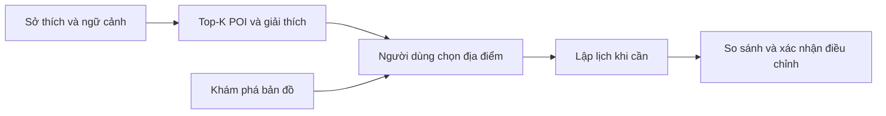

Trang chủ không yêu cầu người dùng chọn POI trước khi nhận gợi ý. Điểm xếp hạng chỉ có ý nghĩa trong lượt gợi ý; giao diện không biến 0,8 thành “80% phù hợp”. Dữ liệu thiếu hiển thị riêng. Mất OSRM vẫn có gợi ý theo nội dung và khoảng cách địa lý; tạo tuyến lịch trình tiếp tục cần dữ liệu đường bộ thực.

## 3. Kiến trúc và mã nguồn

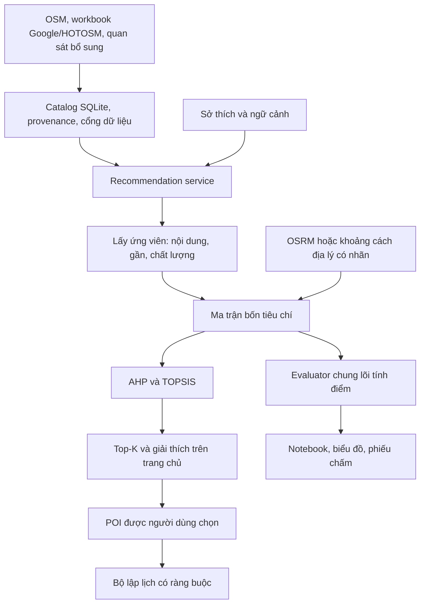

| Thành phần | Vai trò |
|---|---|
| `where2go/v2/recommendations.py` | Request, bốn mẫu ưu tiên, tập ứng viên, mode di chuyển, tính điểm và giải thích |
| `where2go/v2/ranking.py`, `where2go/ranking.py` | TF-IDF/taxonomy, rating prior, AHP/Fuzzy AHP và TOPSIS dùng chung |
| `where2go/v2/recommendation_evaluation.py` | Precision và pooled NDCG; chặn nhãn thiếu |
| `where2go/api.py`, `v2/service.py` | API và điều phối, phục vụ ba trang |
| `web/common.js` | Thành phần thẻ, truy cập API và nháp theo địa phương |
| `web/recommend.js`, `explore.js`, `app.js`, `map.js` | Ba luồng giao diện và bản đồ dùng chung |
| `v2/trips.py`, `trip_models.py` | Lập lịch theo lựa chọn; adapter API gợi ý cũ |
| `v2/planner.py`, `models.py` | Planner nghiên cứu cũ, còn dùng cho đối chiếu lịch trình |
| `scripts/evaluate_recommendations.py` | 16 bối cảnh, sáu phương pháp, phiếu chấm, sensitivity |
| `notebooks/phan_tich_du_lieu_poi.ipynb` | EDA nguồn/catalog và thực nghiệm gợi ý có output |

API trung tâm: `POST /api/v2/recommendations`. Đầu vào: `location`, `start`, `date`, `interests`, `preferred_categories`, `radius_km`, `preset`, `selected_poi_ids`, `top_k`. Đầu ra: `items` với rank/score/criteria/reasons/explanation/provenance; `ranking` chứa trọng số và CR; số POI đủ điều kiện và số ứng viên; `travel_metric`, `travel_unit`, `dataset_version`, `policy_version`.

`POST /api/v2/trip-suggestions` tiếp tục lập lịch. `/api/v2/trip-recommendations` là adapter giữ cấu trúc `featured/contextual` cho tương thích; trang chủ mới dùng `items`, không xếp landmark biên tập lên đầu. `/api/v2/itineraries` tiếp tục phục vụ nghiên cứu planner. `GET /api/v2/pois?view=explore` và `/api/v2/map-pois` phục vụ tra cứu toàn quốc.

Giữ các mô hình và tiện ích v1 còn được import. Giao diện vẫn không cần Node build, không đổi framework hay dựng lại pipeline dữ liệu.

## 4. Nguồn, schema và quy trình dữ liệu

### 4.1. Các nguồn thực sự được dùng

| Nguồn | Đường dẫn/nguồn gốc | Vai trò, giới hạn |
|---|---|---|
| OpenStreetMap | `data/raw/vietnam-260915.osm.pbf`, [Geofabrik Việt Nam](https://download.geofabrik.de/asia/vietnam.html) | Tên, tags, điểm/vùng, website/giờ khi có; cũng là snapshot dựng đường OSRM; ODbL 1.0 |
| Địa giới | `data/vietnam_provinces_wards_geojson.zip`; nguồn ghi trong importer: [vietnamese-provinces-database](https://github.com/thanglequoc/vietnamese-provinces-database) | Gán địa phương bằng polygon; cần giữ thông tin phiên bản và điều kiện sử dụng nguồn |
| Workbook chính | `data/vietnam_destinations_google_maps_browser_hotosm.xlsx` | 8.201 dòng; dữ liệu kế thừa nhiều trường và mức bằng chứng khác nhau |
| Backup 15/09 | `data/vietnam_destinations_google_maps_browser_hotosm_backup_20260915_163012.xlsx` | 8.710 dòng; phiên bản chồng lặp |
| Backup 16/09 | `data/vietnam_destinations_google_maps_browser_hotosm_backup_20260916_150600.xlsx` | 8.710 dòng; phiên bản chồng lặp |
| Quan sát bổ sung | `data/enrichment/accepted*.json` và raw/checkpoint | Google panel được đối chiếu, có thời điểm thu thập; `restricted_internal` |
| Curation | `data/curation/`, `data/manual/poi_enrichment_v2.xlsx` | Landmark, quan hệ cha–con, thời lượng ước lượng và quan sát có nguồn; không mặc nhiên là khảo sát thực địa |

**Không suy nguồn từ tên file.** Tên Google/HOTOSM của workbook không đủ xác định công cụ crawler lịch sử, endpoint HOTOSM, thời điểm hay quyền sử dụng của từng trường. Mã collector hiện hành có thể kiểm tra; không còn đủ bằng chứng để tái dựng toàn bộ lần crawl đầu tiên từ workbook. Thời điểm backup/mtime không thay cho thời điểm quan sát. Các thông tin chưa rõ phải ghi chưa xác định.

### 4.2. Đơn vị dữ liệu và số lượng

| Bảng xuất | Số dòng | Đơn vị |
|---|---:|---|
| `pois.csv` | 16.018 | Thực thể POI canonical |
| `ratings.csv` | 1.277 | Quan sát rating, không phải tất cả đều được dùng xếp hạng |
| `opening_hours.csv` | 9.136 | Khoảng giờ/trạng thái ngày; một POI có nhiều dòng |
| `duration_profiles.csv` | 16.018 | Hồ sơ thời lượng, phần lớn là mặc định thiết kế |
| `access_points.csv` | 16.125 | Điểm tiếp cận/vị trí đại diện |
| `images.csv` | 1.512 | Ứng viên ảnh, có thể nhiều ảnh/POI và chưa được chọn |
| `sources.csv` | 11 | File nguồn ghi nhận trong catalog |
| `field_provenance.csv` | 162.659 | Giá trị trường đang chọn và bằng chứng nguồn |

**25.621 dòng Excel không phải 25.621 POI.** Hợp STT của ba workbook có 8.710 giá trị. Có 4.853 dòng liên kết tới 1.569 POI; 54 dòng ambiguous, 20.714 dòng unmatched trong thống kê hợp nhất. Unmatched không đồng nghĩa địa điểm giả: có thể thiếu tọa độ thực thể hoặc bằng chứng ghép. Pipeline phục hồi 8.153 giá trị trường, tạo 304 POI từ Excel và một POI từ thu thập bổ sung; giữ ID của catalog trước đó.

### 4.3. Ba lớp lưu trữ và truy nguyên

1. **Nguồn:** file bất biến, SHA-256, vai trò, công cụ, điều kiện sử dụng.
2. **Quan sát:** payload của từng dòng/lần crawl; `observed_at`, phương pháp xác minh và trạng thái liên kết.
3. **Catalog:** chọn giá trị theo từng trường cùng `selection_reason`, không chọn nguyên dòng tốt nhất cho mọi thuộc tính.

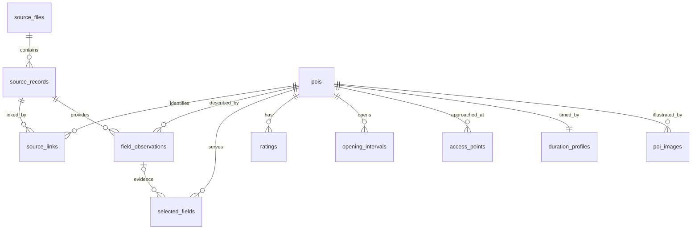

Canonical ID không phải số thứ tự dòng sau lọc. Bảng alias, external ID, redirect và registry phục vụ bảo toàn liên kết. Cùng tên không bảo đảm cùng thực thể; POI khu lớn, điểm con và cổng không thể tự động coi là các lượt tham quan độc lập.

Trình tự build hiện hành: baseline OSM → OSM bổ sung → workbook kiểm duyệt → curation thời lượng/quan hệ/landmark → crawl được chấp nhận → Excel cũ → kiểm tra ảnh → tính lại trạng thái. Đầu ra staging được audit trước khi publish; bản cũ có snapshot hoàn tác. API phải khởi động lại để nạp catalog mới.

## 5. Thu thập, chuẩn hóa và hợp nhất

### 5.1. OSM và địa giới

Importer dùng `osmium` đọc node và area từ PBF, lọc tags như `tourism`, `historic`, `amenity`, `leisure`, `natural`. Tên ưu tiên `name:vi`, sau đó `name`; taxonomy chuẩn hóa thành loại dùng trong dự án. Polygon OSM dùng `representative_point()` để có điểm nằm trong vùng, **không phải cổng vào**. Shapely/STRtree tìm polygon địa phương chứa điểm bằng `covers`; luồng hiện tại không tự gán tỉnh gần nhất khi điểm nằm ngoài polygon.

Script bổ sung OSM chỉ thu nhóm ăn/nghỉ, chợ và một số loại thiên nhiên tại Hà Nội/Đà Nẵng. Vì vậy toàn catalog có thiên lệch phạm vi theo loại hình. Không dùng số nhà hàng giữa các tỉnh để xếp hạng mức phát triển du lịch.

### 5.2. Google collector hiện hành

Các bước trong [`google_collector.py`](../where2go/v2/google_collector.py), [`collect_enrichment_v2.py`](../scripts/collect_enrichment_v2.py), [`review_enrichment_v2.py`](../scripts/review_enrichment_v2.py):

1. Chuẩn bị hàng đợi thiếu trường, ưu tiên POI trọng tâm; seed gồm canonical ID, tên/alias, địa phương và vị trí tham chiếu.
2. Playwright Firefox mở URL địa điểm hoặc truy vấn tìm kiếm; dùng parser DOM ngoài được pin commit `283f50c179da23f36f2df5bb638df5ba5ab9a15b` của `noworneverev/google-maps-scraper`.
3. Chọn panel thực thể, loại màn hình “Results”. Khi phải chọn kết quả tìm kiếm, yêu cầu tên đủ giống; ưu tiên ứng viên duy nhất trong 300 m, không chọn tùy tiện khi có nhiều ứng viên gần.
4. Lấy tên, ID, địa chỉ, loại hình, rating/review, giờ, website, điện thoại, ảnh và tọa độ thực thể khi nguồn cung cấp.
5. Tọa độ lấy từ phần thực thể trong URL hoặc marker thực thể đang được chọn. `@lat,lng` là tâm khung nhìn, được tách riêng và không dùng làm vị trí POI.
6. Lưu raw, payload chuẩn hóa, thời điểm và trạng thái sau **từng lần thử** bằng ghi file tạm rồi thay thế. Duyệt tuần tự, nghỉ ba giây giữa mục tiêu.
7. Resume bỏ qua record đã có; retry có chọn trạng thái. Khi gặp thử thách truy cập thì lưu `blocked` và dừng.
8. Review riêng bằng OSM/geometry hoặc quyết định curation có URL bằng chứng; chỉ `accepted=true` với `tool_confirmed` mới được importer nhận.

Điều kiện sơ bộ ở collector là external ID đã đối chiếu khớp, hoặc tên giống ít nhất 0,72 cùng vị trí trong 300 m/địa phương phù hợp; luôn cần ID và tọa độ thực thể. **Đây chưa phải cổng nhập dữ liệu cuối.** Review mặc định chặt hơn: tên khớp chuẩn hóa, vị trí gần hoặc trong polygon, loại hình tương thích; trường hợp đặc biệt cần quyết định bằng chứng riêng.

`complete` nghĩa là lấy được đủ nhóm trường; không chứng minh đúng thực thể. `tool_confirmed` là đối chiếu bằng công cụ, không phải người đã đến tận nơi. Timeout DOM 45 giây, bước đợi panel 12 giây và khoảng nghỉ là cấu hình kỹ thuật; không bảo đảm crawler luôn hoạt động khi giao diện nguồn thay đổi.

### 5.3. Quy tắc ghép và chất lượng trường

Hàm chuẩn hóa bỏ dấu tiếng Việt, chuyển `đ → d`, chữ thường, tách ký tự từ. Tên/bí danh chuẩn hóa và external ID tạo tập ứng viên. Với POI dạng điểm, ghép còn đòi vị trí trong 300 m và loại tương thích; vùng lớn có thể dùng geometry. Nhiều ứng viên, tỉnh mâu thuẫn hoặc ID xung đột được đưa vào review queue.

Độ giống chuỗi dùng `SequenceMatcher`; có thể biểu diễn $s=2M/(|a|+|b|)$, với $M$ là tổng độ dài các khối khớp mà thuật toán tìm được. Nó không phải xác suất ghép đúng hoặc embedding ngữ nghĩa. Tên trùng “Mỹ Khê” vẫn phải phân biệt Đà Nẵng và Quảng Ngãi bằng vị trí.

Rating và số review phải cùng nhà cung cấp, cùng quan sát được chấp nhận. Các rating kế thừa không chứng minh được điều đó giữ `same_observation=0`; không ghép rating của lần A với count lần B. Thiếu dữ liệu không được điền bằng rating giả.

Giờ mở cửa phân biệt `unknown`, đóng cửa và các khoảng mở. Chỉ nguồn nói rõ `24/7` mới được ghi cả ngày. Ảnh có URL nguồn, trạng thái danh tính, MIME, kiểm tra nội dung/kích thước; loại avatar/logo/ảnh nhỏ và giữ ảnh dùng chung để kiểm tra. HTTP 200 không đủ chứng minh ảnh đúng POI; chưa có kiểm duyệt nội dung toàn bộ bởi người.

### 5.4. Kết quả thu thập đã ghi nhận

| Đợt | Mục tiêu duy nhất | Được chấp nhận sau review | Cần xem lại | Người xác minh |
|---|---:|---:|---:|---:|
| Pilot | 20 | 19 | 1 | 0 |
| Mở rộng | 129 | 70 | 59 | 0 |
| Tổng | 149 | 89 | 60 | 0 |

Pilot đạt cổng 19/20 mới cho chạy lô trên 20, tối đa 200 mục tiêu/lô. Báo cáo cũ ghi 179 lượt thử cho 149 mục tiêu; mẫu số tỷ lệ chấp nhận phải là **mục tiêu duy nhất**, không trộn với lượt thử. Tỷ lệ 89/149 = 59,73% là tỷ lệ tiếp nhận sau đối chiếu, **không phải accuracy có nhãn chuẩn**. Hai đợt không ngẫu nhiên và có độ khó khác nhau.

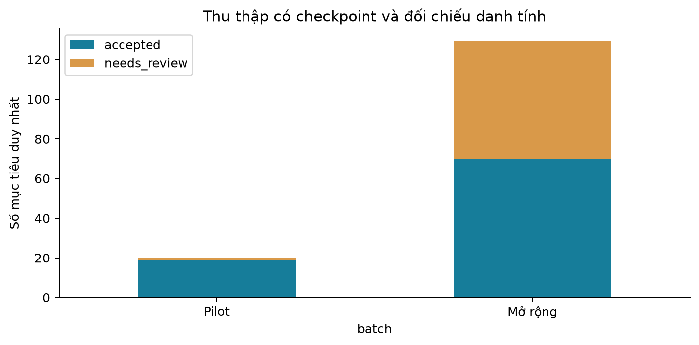

## 6. Phân tích và đánh giá chất lượng dữ liệu

### 6.1. Phương pháp phân tích có thể tái lập

Notebook đọc CSV xuất từ catalog, đối chiếu số dòng với `summary.json`, kiểm tra ID duy nhất, khóa ngoại, miền tọa độ và dataset version. Tạo bảng phân bổ, độ phủ từng trường/từng loại/từng thành phố, rating–review, độ mới provenance, ứng viên trùng tên, kết quả crawl và evaluator. Lưu SHA-256 đầu vào cùng phiên bản thư viện trong [`analysis_summary.json`](../data/reports/analysis/analysis_summary.json).

Notebook không gọi mạng hoặc thay catalog. Các biểu đồ là kết quả chạy thật trên dữ liệu hiện có. Ví dụ số TOPSIS trong notebook được ghi rõ là giả định để giải thích công thức, không trộn vào số liệu dataset.

### 6.2. Phân bổ địa lý và loại hình

| Địa phương | POI | Tỷ lệ toàn catalog |
|---|---:|---:|
| Hà Nội | 4.499 | 28,09% |
| Đà Nẵng | 2.752 | 17,18% |
| Hồ Chí Minh | 2.419 | 15,10% |
| An Giang | 637 | 3,98% |
| Đồng Nai | 552 | 3,45% |
| Các địa phương còn lại | 5.159 | 32,21% |

Có dữ liệu ở 34 địa phương. Hà Nội và Đà Nẵng chiếm **45,27%**; ba địa phương đầu chiếm **60,37%**. Loại hình lớn nhất là temple (6.068), restaurant (2.909), cafe (2.335), park (1.500), attraction (969), historic (902). Catalog hiện có 17 loại xuất hiện trên taxonomy hỗ trợ 18 loại; không đồng nghĩa tất cả nhóm trải nghiệm được phủ tốt.

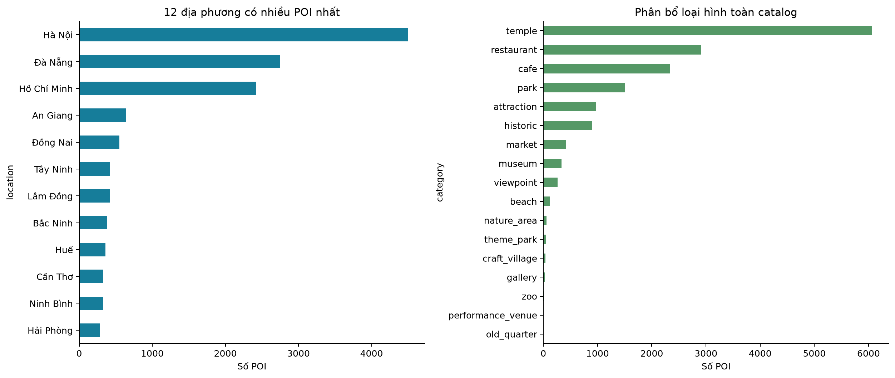

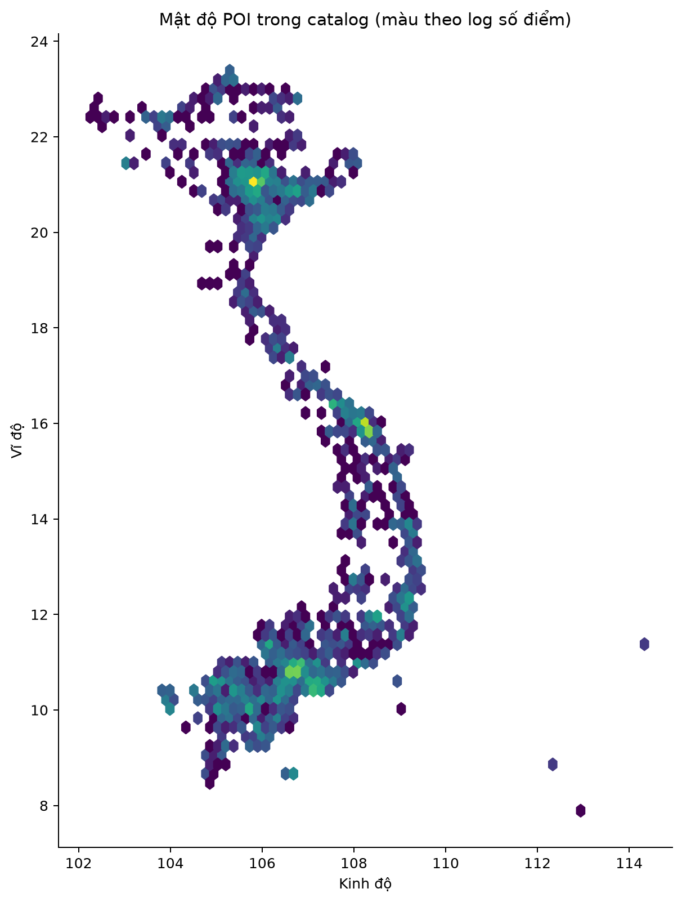

**Diễn giải:** dữ liệu nghiêng về địa phương được đầu tư thu thập và nhóm có tags OSM phổ biến. Đây là thiên lệch thu thập, không thể kết luận “chùa là nhu cầu du lịch phổ biến nhất” từ số lượng bản ghi. Mật độ tọa độ không kiểm chứng đúng địa điểm hay đường tiếp cận.

### 6.3. Độ phủ toàn catalog

Tất cả tỷ lệ ở bảng này dùng mẫu số **16.018 POI**.

| Thuộc tính/điều kiện | Có dữ liệu | Tỷ lệ | Ý nghĩa |
|---|---:|---:|---|
| Tên, tọa độ trong miền hợp lệ | 16.018 | 100% | Đúng kiểu/miền, chưa chứng minh đúng thực địa |
| Khám phá được | 15.245 | 95,17% | Qua điều kiện danh tính/vị trí/tên |
| Mô tả không rỗng | 1.693 | 10,57% | TF-IDF bị hạn chế bởi mô tả thưa |
| Đủ metadata gợi ý tự động | 1.475 | 9,21% | Trên toàn catalog; lịch trình vẫn chỉ hai thành phố |
| Giờ có cấu trúc | 1.244 | 7,77% | Có thể chỉ biết một phần tuần |
| Giờ đủ bảy ngày | 1.174 | 7,33% | Không bảo đảm đúng ngày lễ hoặc còn cập nhật |
| Ảnh đã chọn | 1.048 | 6,54% | Kiểm tra kỹ thuật, chưa duyệt nội dung toàn bộ |
| Website HTTP(S) | 554 | 3,46% | Là kênh có thể kiểm chứng thêm |
| Rating–review hợp lệ được chọn | 86 | 0,54% | Độ phủ quá thấp để coi rating là tín hiệu phổ quát |
| Thời lượng riêng theo POI | 33 | 0,21% | Ước lượng có curation, chưa xác minh |
| Thời lượng xác minh | 0 | 0% | Không có nhãn thời gian tham quan thực |
| Lối vào xác minh | 0 | 0% | Tọa độ thực thể chưa thành cổng ô tô |

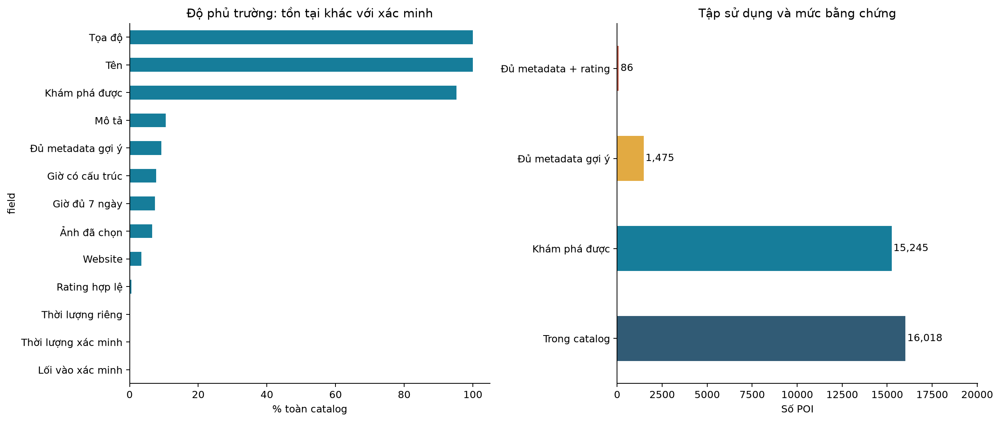

Trạng thái lưu trữ: 15.430 `usable`, 273 `needs_review`, 315 `excluded`. `usable` không đồng nghĩa `explorable`, cũng không đồng nghĩa đủ điều kiện đề xuất tự động. Trong 1.475 POI đủ metadata, chỉ 86 có rating hợp lệ (5,83%); 257 chưa biết giờ. Bảng rating có 1.277 quan sát nhưng chỉ 101 dòng cùng quan sát được chấp nhận, thuộc 86 POI.

### 6.4. Hai địa phương trọng tâm và tập ưu tiên

| Chỉ số | Hà Nội | Đà Nẵng |
|---|---:|---:|
| Toàn bộ / usable | 4.499 / 4.485 | 2.752 / 2.691 |
| Đủ metadata | 742 | 493 |
| Đủ metadata: tham quan / ăn-nghỉ | 71 / 671 | 63 / 430 |
| Rating hợp lệ trong usable | 39 / 4.485 = 0,87% | 47 / 2.691 = 1,75% |
| Giờ cấu trúc trong usable | 623 / 4.485 = 13,89% | 428 / 2.691 = 15,90% |
| Hồ sơ thời lượng riêng | 15 | 18 |
| Tập ưu tiên | 50 tham quan + 20 ăn-nghỉ | 50 tham quan + 20 ăn-nghỉ |
| Có giờ trong tập ưu tiên | 58 / 70 = 82,86% | 59 / 70 = 84,29% |

Tập ưu tiên đạt độ phủ giờ cao hơn toàn thành phố vì được chọn và bổ sung có chủ đích. Không dùng 82–84% để mô tả cả dataset. Mục tiêu thời lượng đã xác minh vẫn chưa đạt. Biểu đồ heatmap cho thấy thiếu dữ liệu khác nhau theo loại hình, cần công bố phân tầng khi đánh giá.

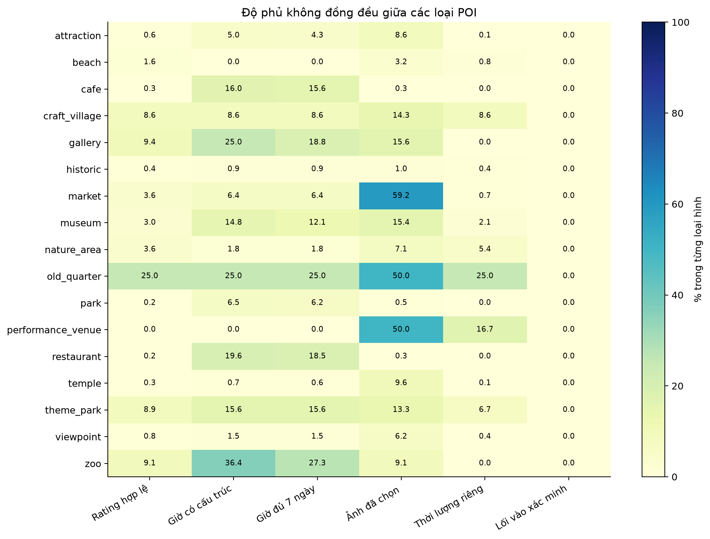

### 6.5. Rating, độ mới và trùng lặp

86 POI có rating được chọn có trung vị rating **4,5** và trung vị số review **543**. Mẫu nhỏ và được thu thập có mục tiêu; không suy rộng thành chất lượng trung bình của 16.018 POI. Review là lượng phản hồi cộng đồng, không phải số người dùng trong hệ thống.

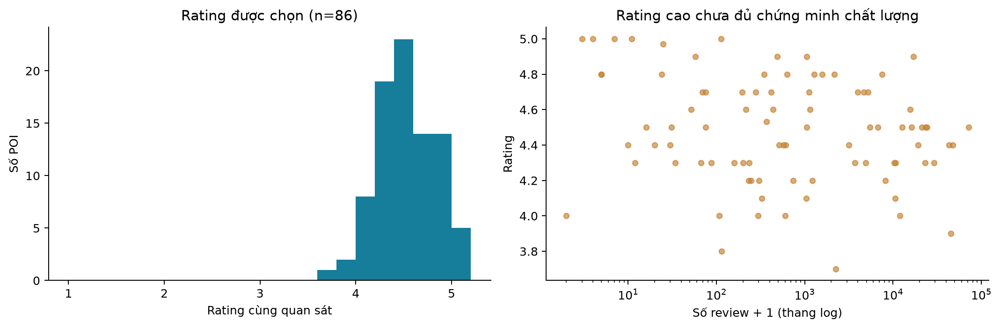

Có **22.154/162.659 = 13,62%** giá trị trường được chọn không có ngày quan sát. Các trường còn lại có `observed_at` trong 180 ngày tính theo ngày tham chiếu 18/09/2026; điều này chỉ nói thời điểm ghi nhận nguồn. Ngày ingest/snapshot của OSM không chứng minh cửa hàng vừa được kiểm tra hoạt động. Muốn đánh giá freshness của sự thật cần thêm ngày cập nhật nguồn hoặc ngày xác minh từng thuộc tính.

Có **827 nhóm trùng tên chuẩn hóa trong cùng địa phương** trên toàn catalog. Đây là hàng ứng viên để kiểm duyệt; không phải 827 lỗi trùng thực thể. Không xóa hàng loạt các địa điểm cùng tên. Audit cấu trúc ghi nhận một nhóm tên điểm tham quan đủ metadata cần xem xét, cùng nhiều cảnh báo thiếu bằng chứng.

### 6.6. Kết luận chất lượng dữ liệu

| Khía cạnh | Kết luận có bằng chứng | Việc còn thiếu |
|---|---|---|
| Tính đầy đủ | Tên/vị trí phủ rộng; rating/giờ/duration/access thưa | Bổ sung trọng tâm và báo cáo tỷ lệ theo nhóm |
| Nhất quán | ID, khóa ngoại, miền giá trị và export qua audit | Audit không chứng minh tất cả quan sát đúng |
| Độ chính xác | Có ghép nhiều nguồn và giữ trường hợp mơ hồ | Mẫu chuẩn do người xác minh độc lập |
| Độ mới | Có thời điểm cho nhiều quan sát, thiếu 13,62% trường | Phân biệt snapshot, cập nhật thực thể, kiểm chứng thực địa |
| Tính đại diện | 34 địa phương nhưng tập trung ở đô thị/nhóm chọn | Lấy mẫu phân tầng, tránh suy rộng độ phủ |
| Khả năng dùng để học | Có metadata cho content-based | Chưa có ma trận user–POI, chuỗi check-in hoặc đồ thị xã hội |

**Đánh giá tổng thể:** phù hợp làm prototype khám phá và hỗ trợ quyết định có cảnh báo; đủ để phân tích hệ thống đa tiêu chí; chưa đủ bằng chứng cho dịch vụ đảm bảo giờ/cổng/thời lượng thực tế hoặc mô hình học hành vi như hai paper.

## 7. Công thức xếp hạng và lý do lựa chọn

### 7.1. Bộ lọc trước khi chấm điểm

Không đưa mọi bản ghi vào TOPSIS. `explorable` kiểm tra trạng thái, danh tính, tên, địa phương và tọa độ. `manual_trip_quality` thêm điều kiện thuộc địa phương chuyến đi, hỗ trợ Hà Nội/Đà Nẵng và không báo đóng cửa. `recommendation_eligible` thêm cổng metadata.

Cổng metadata hiện dùng các biến nhị phân: $r$ có rating pair, $h$ có giờ cấu trúc, $w$ có website, $d$ có mô tả đủ điều kiện, $t$ có thời lượng riêng, $a$ có access xác minh:

$$
E_{serve}=2r+2h+2w+d+3t+3a.
$$

Cần $E_{serve}\ge2$ và không có lý do chặn danh tính, tên chung chung, loại hình mâu thuẫn hoặc đóng cửa. Đây là chính sách bằng chứng, **không phải** điểm hấp dẫn hoặc confidence của TOPSIS. Hàm chọn tập ưu tiên có điểm riêng $E_{priority}=4r+3h+2w+d+3t+3a$. Không trộn hai công thức.

Khoảng cách Haversine để lọc địa lý/ghép nguồn:

$$
a=\sin^2\frac{\Delta\varphi}{2}+\cos\varphi_1\cos\varphi_2\sin^2\frac{\Delta\lambda}{2},\qquad
d=2R\arcsin\sqrt a,\ R=6371\text{ km}.
$$

Vĩ độ/kinh độ dùng radian. Đây là khoảng cách trên mặt cầu, không phải thời gian lái xe.

### 7.2. Bốn tiêu chí trong v2

| Thứ tự | Tiêu chí | Chiều | Trọng số thiết kế | Lý do và rủi ro |
|---|---|---|---:|---|
| 1 | `preference_match` | Benefit | 0,40 | Bám sở thích chuyến đi; phụ thuộc taxonomy và văn bản thưa |
| 2 | `place_quality` | Benefit | 0,30 | Dùng phản hồi cộng đồng có hiệu chỉnh; rất thiếu rating |
| 3 | `travel_cost` | Cost | 0,20 | Giây OSRM hoặc km đường chim bay, một đơn vị cho cả lượt; chưa là chi phí đường vòng |
| 4 | `data_confidence` | Benefit | 0,10 | Ưu tiên bằng chứng phục vụ; không phải xác suất chính xác |

Các trọng số 0,40/0,30/0,20/0,10, tỷ lệ 0,7/0,3 và $m=50$ là **tham số thiết kế**, chưa được khảo sát chuyên gia hoặc tối ưu trên nhãn độc lập. Giao diện dùng bốn mẫu cố định phía server:

| Mẫu | Sở thích | Chất lượng | Di chuyển | Bằng chứng |
|---|---:|---:|---:|---:|
| Cân bằng | 0,40 | 0,30 | 0,20 | 0,10 |
| Hợp sở thích | 0,55 | 0,20 | 0,15 | 0,10 |
| Đi gần | 0,30 | 0,20 | 0,40 | 0,10 |
| Đánh giá địa điểm | 0,25 | 0,45 | 0,20 | 0,10 |

Tên Cân bằng không có nghĩa bốn trọng số bằng nhau. Từ mẫu $w$, tạo $a_{ij}=w_i/w_j$ nên ma trận nhất quán theo thiết kế; CR gần 0 không chứng minh trọng số khách quan hoặc tối ưu. API planner nghiên cứu vẫn cho nhập sáu so sánh cặp và bất định.

### 7.3. Sở thích: taxonomy và TF-IDF

Với $I$ là tập token sở thích, $T_i$ là token tags/taxonomy của POI:

$$
P_{tax}(i)=\frac{|I\cap T_i|}{|I|}.
$$

Nếu POI thuộc loại hình được ưu tiên thì $P_{tax}=1$. Nếu chỉ có category mà không có từ khóa, các POI ngoài loại ưu tiên có thành phần taxonomy bằng 0. Nếu cả sở thích và category đều trống, trả **1 cho mọi POI**, làm tiêu chí này không phân biệt ứng viên.

Corpus hiện dùng tên, alias, mô tả, nhãn loại hình, tags POI và tags taxonomy có sẵn; chuẩn hóa bỏ dấu, unigram và bigram, tối đa 20.000 đặc trưng. Với mặc định `TfidfVectorizer`:

$$
idf(t)=\log\frac{1+N}{1+df(t)}+1,\qquad z_{it}=tf(t,i)\,idf(t),\qquad
\hat z_i=\frac{z_i}{\|z_i\|_2}.
$$

Query gồm từ khóa và tags của category đã chọn. Tích vô hướng hai vector đã chuẩn hóa là cosine:

$$
P_{text}(i)=\hat z_i^T\hat z_q,\qquad
P_i=0,7P_{tax}(i)+0,3P_{text}(i).
$$

Vector không có từ trong vocabulary cho similarity 0. Lý do dùng: nhẹ, kiểm tra được và không cần lịch sử người dùng. Hạn chế: bỏ dấu có thể mất phân biệt từ; khớp từ không hiểu đầy đủ ý nghĩa, đồng nghĩa hoặc ngữ cảnh; taxonomy thủ công có thiên lệch. Fit TF-IDF trên catalog hiện có không phải huấn luyện mô hình hành vi; khi đánh giá theo thời gian sau này phải dùng catalog/vocabulary sẵn có tại thời điểm đó.

### 7.4. Rating có hiệu chỉnh prior

Chọn quan sát hợp lệ mới nhất theo `observed_at`: rating hữu hạn trong [1,5], review count nguyên không âm, `same_observation=true`. Prior $C$ là trung bình rating cùng provider, ưu tiên cùng category–địa phương nếu có ít nhất 10 POI; nếu không, lùi về category rồi toàn provider.

$$
Q_i=\frac{1}{5}\left(\frac{v_iR_i+mC}{v_i+m}\right),\qquad m=50.
$$

Có thể viết $Q_i=\frac15[\alpha_iR_i+(1-\alpha_i)C]$, $\alpha_i=v_i/(v_i+m)$. Review ít thì dựa prior nhiều hơn; review lớn thì gần rating gốc. Đây là **shrinkage/Bayesian-style adjustment**, chưa xây dựng posterior có phương sai hoặc chứng minh review độc lập.

Nếu không có rating hợp lệ hoặc không có prior, criterion nhận **0,5 theo quy ước**, không tạo một rating 2,5 thật trong nguồn. “Trung tính” ở đây là mặc định chính sách: 0,5 vẫn thấp hơn đa số rating/5 trong mẫu, nên có thể khiến POI thiếu rating bị xếp thấp hơn. Cần kiểm tra ablation bỏ tiêu chí chất lượng hoặc thêm cách xử lý missingness trước khi khẳng định công bằng.

### 7.5. Thời gian di chuyển và chỉ số bằng chứng

$$
D_i=t^{OSRM}_{s\rightarrow i}\quad\text{(giây, cost)},\qquad
F_i=\frac{b_{identity}+b_{access}+b_{hours}+b_{recent}}4.
$$

Trong đó: danh tính được liên kết; có access xác minh; giải được giờ cho ngày yêu cầu; kiểm tra hoạt động cách ngày yêu cầu từ 0 đến 180 ngày. Ngày kiểm tra tương lai không được tính là recent. Mỗi thành phần là 0 hoặc 1. Vì access hiện chưa xác minh, confidence có một thành phần yếu một cách hệ thống. Đây không phải xác suất POI “tốt 75%”.

Trong API gợi ý mới:

$$
D_i=\begin{cases}t^{OSRM}_{s\to i}\ (\text{giây}),&\text{đủ đường đi/quay về cho toàn pool, snap hợp lệ, snapshot khớp},\\
d_{Haversine}(s,i)\ (\text{km}),&\text{ngược lại.}\end{cases}
$$

OSRM lấy theo lô tối đa 30 ứng viên cộng điểm xuất phát. Nếu một lô thiếu tuyến hoặc snap quá 300 m, bỏ toàn bộ chi phí OSRM đã thu và dùng khoảng cách địa lý cho cả pool. Không trộn hai đơn vị, không quy đổi km thành thời gian giả. API ghi mode và đơn vị; không có đường bộ không có nghĩa đã chứng minh POI không thể đến bằng mọi phương tiện. Bộ lập lịch vẫn cần đường OSRM, không dùng fallback km để dựng timeline.

### 7.6. AHP: từ so sánh cặp đến kiểm tra nhất quán

Với bốn tiêu chí, cần $4(4-1)/2=6$ so sánh theo thứ tự (1,2), (1,3), (1,4), (2,3), (2,4), (3,4). Ma trận reciprocal:

$$
A=(a_{ij}),\quad a_{ii}=1,\quad a_{ji}=1/a_{ij},\quad a_{ij}\in[1/9,9].
$$

Mặc định $a_{ij}=w_i^{(0)}/w_j^{(0)}$, với $w^{(0)}=(0,4;0,3;0,2;0,1)$. Bởi vậy ma trận mặc định nhất quán theo xây dựng, không phải bằng chứng có đồng thuận chuyên gia.

$$
CI=\frac{\lambda_{max}-4}{3},\qquad CR=\max(0,CI/0,90).
$$

Từ chối request nếu $CR>0,1$. Giá trị riêng dùng kiểm tra CR; trọng số bên dưới dùng geometric mean, không dùng vector riêng chính để xếp hạng.

### 7.7. Fuzzy AHP và giải mờ

Mỗi so sánh có $\gamma_{ij}\in[1,2]$, đối xứng theo cặp. Ngoài đường chéo:

$$
\tilde a_{ij}=(a_{ij}/\gamma_{ij},a_{ij},a_{ij}\gamma_{ij}),\quad
\tilde a_{ji}=(1/u_{ij},1/m_{ij},1/l_{ij}),\quad \tilde a_{ii}=(1,1,1).
$$

Geometric mean từng hàng:

$$
\tilde g_i=\left((\prod_j l_{ij})^{1/4},(\prod_j m_{ij})^{1/4},(\prod_j u_{ij})^{1/4}\right).
$$

Chuẩn hóa mờ và giải mờ đúng phép tính trong code:

$$
\tilde w_i=\left(\frac{g_i^L}{\sum_k g_k^U},\frac{g_i^M}{\sum_k g_k^M},\frac{g_i^U}{\sum_k g_k^L}\right),
\qquad d_i=\frac{w_i^L+w_i^M+w_i^U}{3},\qquad w_i=\frac{d_i}{\sum_k d_k}.
$$

**Tính chất quan trọng:** nếu mọi cặp cùng $\gamma$, mỗi hàng có ba phần tử ngoài đường chéo nên $g_i^L=g_i^M\gamma^{-3/4}$, $g_i^U=g_i^M\gamma^{3/4}$. Sau chuẩn hóa và giải mờ, mọi hàng được nhân cùng một hệ số; phép chuẩn hóa cuối triệt tiêu hệ số đó. Do đó:

$$
w_i^{fuzzy}=\frac{g_i^M}{\sum_k g_k^M}=w_i^{crisp}.
$$

Mặc định $\gamma=1,2$ rơi đúng trường hợp này. Notebook xác nhận cả trọng số và 16/16 danh sách lịch fuzzy/crisp trùng nhau. Fuzzy có thể khác khi bất định khác theo cặp, nhưng khác kết quả chưa chứng minh tốt hơn. Lý do chọn AHP là diễn đạt ưu tiên và kiểm tra phán đoán; chỉ nên dùng phần fuzzy để mô tả bất định có bằng chứng.

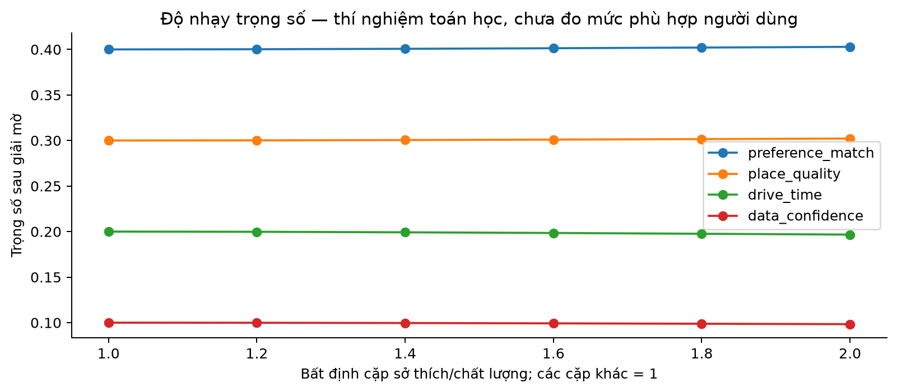

### 7.8. TOPSIS trên bốn tiêu chí

Ma trận $X\in\mathbb R^{n\times4}$, hàng $i$ là $(P_i,Q_i,D_i,F_i)$. Chuẩn hóa vector và gán trọng số:

$$
r_{ij}=\frac{x_{ij}}{\sqrt{\sum_{k=1}^n x_{kj}^2}},\qquad v_{ij}=w_jr_{ij}.
$$

Cột có norm 0 được gán 0. Với tập benefit $B=\{1,2,4\}$, cost $C=\{3\}$:

$$
v_j^+=\begin{cases}\max_i v_{ij}&j\in B\\\min_i v_{ij}&j\in C\end{cases},\qquad
v_j^-=\begin{cases}\min_i v_{ij}&j\in B\\\max_i v_{ij}&j\in C.\end{cases}
$$

$$
D_i^+=\sqrt{\sum_j(v_{ij}-v_j^+)^2},\quad
D_i^-=\sqrt{\sum_j(v_{ij}-v_j^-)^2},\quad
S_i=\frac{D_i^-}{D_i^++D_i^-}.
$$

Nếu tổng hai khoảng cách gần 0, trả 0,5; cột hằng không phân biệt. Sắp giảm $S_i$, hòa điểm phá bằng canonical ID. $S_i$ không phải xác suất người dùng sẽ thích và không nên so tuyệt đối giữa hai pool khác nhau.

Chọn TOPSIS vì kết hợp được benefit/cost, chuẩn hóa khác đơn vị và giải thích ideal tốt/xấu. Hạn chế: phụ thuộc tập ứng viên, có nguy cơ đảo hạng khi thêm/bớt lựa chọn; giả định khoảng cách Euclidean và mức bù trừ có thể không đúng với mọi người dùng. Điều kiện bắt buộc như đóng cửa cần lọc trước, không chỉ trừ vài điểm.

### 7.9. Tập ứng viên và baseline

Sau cổng dữ liệu và bộ lọc ngày/địa phương/bán kính/đã chọn, gọi tập còn lại là $E(q)$. Truy hồi:

$$
A(q)=Top40_{P_i}(E)\cup Top40_{-d_i}(E)\cup Top40_{Q_i}(E),\qquad |A|\le120.
$$

Khử trùng bằng canonical ID; mỗi nhánh hòa điểm phá bằng ID. Khoảng cách nhánh gần là Haversine từ điểm xuất phát. Mẫu ưu tiên không thay pool, giúp so sánh ảnh hưởng trọng số công bằng. Toàn bộ pool được chuẩn hóa/tính TOPSIS trước khi cắt Top-K, nên thay K không đổi điểm. Đây vẫn là truy hồi có giới hạn, không bảo đảm Top-K toàn catalog.

| Phương pháp | Phép tính/ý nghĩa |
|---|---|
| `nearby` | $1-(D_i-D_{min})/(D_{max}-D_{min})$; 0,5 khi cột hằng |
| `quality` | Sắp theo $Q_i$ có hiệu chỉnh rating; thiếu rating dùng 0,5 |
| `content` | Sắp theo $P_i=0,7P_{tax}+0,3P_{text}$ |
| `equal` | TOPSIS với bốn trọng số 0,25 |
| `crisp` | AHP geometric mean + TOPSIS; phương pháp mặc định trang chủ |
| `fuzzy` | Fuzzy AHP giải mờ + TOPSIS; mặc định gamma đồng đều 1,2 |

Sáu phương pháp dùng cùng ma trận cho mỗi bối cảnh. Không so score tuyệt đối của content với TOPSIS. Fuzzy/crisp trùng thứ tự trong 16/16 bối cảnh; đây là tính chất cấu hình đã giải thích ở §7.7.

Ví dụ tính để kiểm tra dấu cost, không phải số liệu người dùng: hai POI có các hàng $(0,9;0,8;600;0,5)$ và $(0,3;0,8;60;0,5)$, trọng số Cân bằng. Cột nội dung sau chuẩn hóa khoảng $(0,9487;0,3162)$, cột thời gian $(0,9950;0,0995)$. Chất lượng/bằng chứng hằng không tạo khoảng cách. Với POI thứ nhất, $d^+\approx0,1791$, $d^-\approx0,2530$, do đó $S\approx0,5855$; POI thứ hai khoảng 0,4145. POI hợp sở thích hơn có thể thắng dù xa hơn, phù hợp tính bù trừ của TOPSIS.

Planner nghiên cứu giữ shortlist riêng 40 tham quan + 20 ăn/nghỉ; utility và baseline của planner không được dùng như chỉ số chất lượng Top-K mới. V1 còn ba tiêu chí, $RI_3=0,58$; không lấy công thức v1 để giải thích bốn tiêu chí hiện tại.

## 8. Lập lịch và các ràng buộc

### 8.1. Mô phỏng một lượt ghé

Dùng đơn vị giây nhất quán. Với điểm $i$, chi phí xe $t_{prev,i}$, thời gian vào/ra một chiều $a_i$, thời lượng ghé $d_i$, các cửa sổ mở $[o_{ik},c_{ik}]$:

$$
arrival_i=finish_{prev}+t_{prev,i},\quad earliest_i=arrival_i+a_i,
$$

$$
begin_i=\min_k\{\max(earliest_i,o_{ik}):\max(earliest_i,o_{ik})+d_i\le c_{ik}\},
$$

$$
wait_i=begin_i-earliest_i,\quad finish_i=begin_i+d_i+a_i,\quad
return=finish_{last}+t_{last,s}\le T.
$$

Không có cửa sổ khả thi thì không thêm điểm. Giờ unknown cho phép tính lịch tạm với $begin=earliest$ kèm cảnh báo, không biến thành giờ mở cả ngày. Ngày lễ Việt Nam không có ngoại lệ xác nhận thì giờ được coi là unknown. Có hỗ trợ khoảng mở qua nửa đêm ở bộ giải giờ, nhưng request chuyến đi vẫn cùng ngày.

Thời lượng ưu tiên user override; nếu không, lấy short/typical/long từ profile theo nhịp đi. Ví dụ museum 30/60/120 phút, beach 45/90/150, theme_park 180/300/480, restaurant 45/60/90. Bảng đầy đủ ở `DEFAULT_PROFILES`; các số này là ước lượng thiết kế, không phải dữ liệu học được.

### 8.2. Beam search của luồng mới

Trạng thái chứa chuỗi đã ghé, thời điểm hiện tại, tổng lái và chờ. Mỗi vòng thử thêm các điểm chưa ghé, giữ tối đa **64** trạng thái sau khử trùng theo tập đã ghé/điểm cuối. Ưu tiên mở rộng theo tuple:

$$
(-|M\cap\pi|,-|\pi|,now,drive,\pi).
$$

Ứng viên có đường về đúng giờ được ưu tiên theo:

$$
(-|M\cap\pi|,-|\pi|,drive+t_{last,s}+0,5\,wait,return,\pi).
$$

Đây là **thứ tự ưu tiên từ điển**, không tối đa tổng TOPSIS. Khi có auto-add, tập tìm kiếm có thể chứa tối đa ba điểm bổ sung; kết quả cuối vẫn báo riêng độ phủ tập người dùng chọn. Thứ tự chỉnh tay chỉ cho phép chuỗi con giữ thứ tự đó; duration override không tự giảm để nhét điểm.

Tối đa 18 thứ tự Route khác nhau và ngân sách tìm kiếm 12 giây; lệnh HTTP đang chờ có timeout riêng nên 12 giây không phải SLA cứng. Mỗi phương án cuối được mô phỏng lại theo Route thật thay vì tin hoàn toàn Table. Kết quả rỗng chỉ nói chưa tìm được trong giới hạn, không chứng minh bài toán vô nghiệm; không có bảo đảm tối ưu toàn cục.

Điểm cha–con/cùng cha bị hạn chế xếp như các chặng xe độc lập, trừ khi có hai access xác minh cách nhau ít nhất 100 m. Bữa ăn tự túc có thể thêm 45 phút trong khung 11:30–14:00 hoặc 18:00–20:00; nghỉ 20 phút khi phù hợp, không khẳng định có nhà hàng tại điểm dừng.

Thời gian dư là $(T-return)/60$ phút. Đệm khuyến nghị:

$$
buffer=\min(45,\max(15,0,1\,drive/60))\text{ phút}.
$$

Luồng mới cảnh báo khi dư ít hơn đệm; không mặc nhiên coi đệm là một block đã chiếm timeline. `ready/provisional` phản ánh một số điều kiện bằng chứng trong code, không phải chứng nhận chuyến đi an toàn hoặc tối ưu. Phải đọc cả `coverage`, `changes` và cảnh báo; riêng trạng thái luồng mới chưa xét duration curation như một nhãn xác minh thực địa.

### 8.3. Planner nghiên cứu được giữ để đối chiếu

`v2/planner.py` dùng greedy multi-start: tối đa ba seed, chèn ứng viên vào các vị trí khả thi, thay cục bộ tối đa ba vòng. Utility hiện hành:

$$
U(\pi)=\sum_{i\in\pi}S_i+0,12\max(0,|categories(\pi)|-1)
+0,15\,\mathbf1[categories(\pi)\cap C\ne\varnothing]
-0,05\frac{drive}{3600}-0,03\frac{wait}{3600}-0,05\sum_{i\in\pi}(1-F_i).
$$

Giới hạn tham quan theo nhịp quick/balanced/relaxed là 5/4/3, cân bằng tối đa hai POI cùng loại, có kiểm tra quay về cộng đệm. Các hệ số utility cũng là thiết kế. Các score baseline có thang đo khác nên việc so utility tuyệt đối giữa phương pháp không đo chất lượng người dùng. Luồng mới bỏ giới hạn 3/4/5 và không dùng utility này để loại điểm người dùng đã chọn.

## 9. Thực nghiệm và cách diễn giải

### 9.0. Thực nghiệm Top-K của luồng đang phục vụ

Nguồn: `data/reports/recommendations/evaluation.json`, `matrices.json`, `sensitivity.json`; notebook phần 11–13 và `data/reports/analysis/recommendation_summary.json`. Policy `poi-recommendation-1.0`, snapshot `v2-ae66988a1053d0de`, ngày yêu cầu cố định 20/09/2026.

**Thiết kế:** 16 bối cảnh từ hai địa bàn, mỗi địa bàn 2 development + 6 holdout. Chia theo yêu cầu, không chia người dùng hay check-in. Sáu phương pháp × 16 = **96 lượt**. Cùng catalog, query, pool và ma trận trong mỗi bối cảnh; 12 bối cảnh có OSRM đầy đủ, 4 chuyển toàn bộ về khoảng cách địa lý. Sau cổng dữ liệu, trước ngày/bán kính: Hà Nội 742, Đà Nẵng 493 POI đủ điều kiện đề xuất trong catalog đang dùng.

**Kết quả mô tả trên 12 holdout** (không phải relevance):

| Phương pháp | Loại hình trung bình/Top-10 | Khoảng cách địa lý trung bình (km) |
|---|---:|---:|
| Gần nhất | 3,33 | 2,31 |
| Chất lượng rating | 5,67 | 9,74 |
| Chỉ nội dung | 3,08 | 8,61 |
| TOPSIS trọng số đều | 4,00 | 6,11 |
| AHP–TOPSIS | 3,67 | 6,69 |
| Fuzzy AHP–TOPSIS | 3,67 | 6,69 |

Khoảng cách ở bảng đều là Haversine để cùng đơn vị, kể cả lượt xếp hạng dùng OSRM. Content ưu tiên nội dung nên có thể xa; Nearby ưu tiên di chuyển nên gần. Nhiều loại hình hơn không đồng nghĩa đúng một nhu cầu chuyên đề hơn. Không có nhãn thì chưa kết luận phương pháp nào tốt nhất.

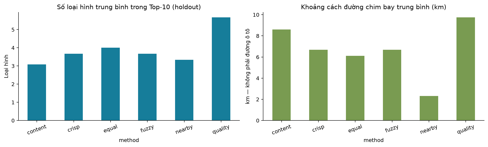
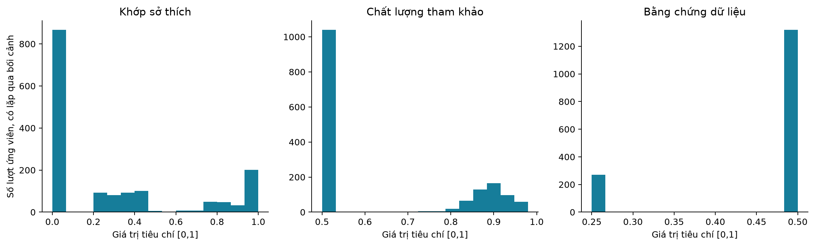

**Độ nhạy:** trên cả 16 bối cảnh, đổi từ Cân bằng sang Hợp sở thích/Đi gần/Đánh giá có overlap Top-10 trung bình lần lượt **0,9125 / 0,76875 / 0,8375**. Với cùng mode địa lý, pool 20/nhánh và 80/nhánh so với 40/nhánh có overlap **0,9375 / 0,9625**. Vì chuẩn hóa TOPSIS phụ thuộc pool, tăng pool vẫn có thể đổi hạng; đây không phải bằng chứng pool lớn kém hơn. Ở 12 ca có OSRM, thay cost bằng địa lý cho overlap trung bình **0,9417**. Bốn ca vốn fallback không được tính vào phép so này.

$$
Overlap@K=\frac{|L_{ref}^K\cap L_{variant}^K|}{|L_{ref}^K|},\quad
H(L)=-\sum_c p_c\log_2p_c,\quad
Coverage=\frac{|\bigcup_q L_q^K|}{|E_{catalog}|}.
$$

Overlap không đo thứ tự, entropy chỉ đo phân tán loại hình. Mẫu số coverage là cổng catalog ở hai địa bàn trước bộ lọc ngày/bán kính; không lấy toàn bộ 16.018 POI làm mẫu số đề xuất. Bảng chi tiết được notebook xuất thành CSV.

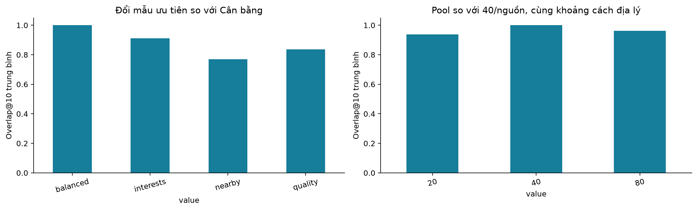
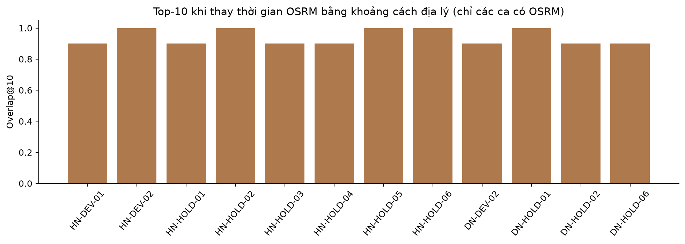

**Đánh giá do nhóm chấm:** `grading_template.csv` gộp union Top-10 của sáu phương pháp, khử trùng và xáo trộn với seed cố định; chỉ có ngữ cảnh, nội dung POI, nguồn và khoảng cách, không có tên thuật toán/thứ hạng. Nhóm chấm 0 = không phù hợp, 1 = ít phù hợp, 2 = phù hợp, 3 = rất phù hợp; ghi lý do và tạo nhãn đồng thuận. Chưa có phiếu đã chấm: **NOT GRADED**, không có Precision/NDCG thật.

Khi có nhãn, relevance nhị phân là $g\ge2$, gain NDCG là $2^g-1$. Precision giữ mẫu số K ngay cả danh sách ngắn. IDCG chỉ được tính trên pooled set đã chấm đầy đủ; một nhãn còn trống thì không tính metric cho bối cảnh đó. IDCG=0 thì NDCG không xác định. Không báo Recall toàn catalog. Tách development/holdout khi tổng hợp, công bố số ca đủ nhãn. Nếu điều chỉnh tham số sau khi xem holdout, phải tạo tập đánh giá mới hoặc thừa nhận kết quả mang tính khám phá.

Thiên lệch: người chấm thuộc nhóm tác giả, pool chỉ chứa top của các phương pháp tham gia, bối cảnh có chủ đích và mẫu nhỏ. Vì vậy số đo tương lai chỉ là **case study tự chấm**, chưa chứng minh hiệu quả trên dân số người dùng độc lập. Thời gian lưu trong evaluator là nhật ký một lượt, chưa phải benchmark p50/p95.

Kiểm chứng bản ba trang: **117/117 pytest PASS**, Ruff PASS, notebook **13 code cell / 14 biểu đồ PASS**, smoke desktop/mobile và bản đồ offline PASS; luồng lịch trình kiểm tra với OSRM thật, nháp qua trang và phản hồi cũ. Bản ghi tại `data/reports/analysis/recommendation_verification.json`; ảnh và log trình duyệt trong `artifacts/recommendations/`. Nhãn relevance vẫn **NOT GRADED**.

Các mục 9.1–9.3 dưới đây giữ bằng chứng kỹ thuật/lịch trình của giai đoạn trước. Những bảng planner này không dùng để kết luận chất lượng gợi ý mới; corpus nội dung hiện đã bổ sung taxonomy nên muốn so planner theo mã hiện tại phải chạy lại evaluator tương ứng.

### 9.1. Ba tầng bằng chứng

| Tầng | Câu hỏi | Bằng chứng hiện có |
|---|---|---|
| Đúng kỹ thuật | Code, API, dữ liệu, timeline có nhất quán không? | Pytest, audit, smoke và kiểm tra Route/Table |
| Khả năng tạo phương án | Các tình huống cụ thể có lịch/hành động điều chỉnh không? | 16 × 4 lượt planner nghiên cứu; bảy tình huống lịch mới |
| Chất lượng gợi ý | Người dùng có thấy phù hợp và chuyến đi có đúng thực tế không? | Chưa có nhãn độc lập/nghiên cứu người dùng/khảo sát thực địa |

Không dùng “107 tests pass” thành “độ chính xác recommendation 100%”. Audit PASS có nghĩa không có lỗi cứng trong các điều kiện được kiểm tra, không có nghĩa dữ liệu hoàn hảo.

Kết quả kiểm chứng trong đợt làm sạch/biên soạn, lưu tại [`verification.json`](../data/reports/analysis/verification.json):

| Kiểm tra đã chạy | Kết quả | Phạm vi |
|---|---|---|
| Pytest sau dọn import | PASS, 107/107 | Các hợp đồng và trường hợp trong bộ test; một cảnh báo deprecation từ thư viện |
| Ruff, pip check, cú pháp ba file JS | PASS | Import/biến không dùng, tên không xác định, dependency và cú pháp |
| Notebook | PASS, 10 code cell, 10 biểu đồ | CSV đúng snapshot, bảng tổng hợp, toán AHP và báo cáo evaluator |
| Audit catalog active | PASS, 0 lỗi cứng, 4.599 cảnh báo | Cảnh báo là số vấn đề, một POI có thể xuất hiện nhiều lần |
| Evaluator ranking với OSRM | PASS, 64 lượt | Trạng thái, ID/thứ tự chọn, phút lái, giờ về và ranking khớp báo cáo trước dọn mã |
| Evaluator lịch nhiều phương án | PASS, bảy ca | Timeline không chồng lấn, tổng thời gian khớp Route theo kiểm tra trong script |
| Smoke lựa chọn lịch | PASS | Desktop, mobile offline, lỗi ảnh, điều khiển bàn phím và phản hồi cũ |
| Smoke khám phá | PASS | 15.245 marker, phân trang danh sách, ảnh hai điểm demo, online/mobile offline |
| Chất lượng gợi ý có nhãn độc lập, thử người dùng, xác minh thực địa | NOT RUN | Không suy từ các PASS kỹ thuật |

Đợt này không crawl mới hoặc rebuild/publish catalog; các file nguồn và snapshot phân tích được giữ. Việc tái hiện huấn luyện hai paper cũng **NOT RUN**; nội dung đối chiếu dựa vào đọc paper và mã dự án.

### 9.2. Kết quả 16 kịch bản × bốn phương pháp

Đầu vào ở [`v2_scenarios.json`](../data/evaluation/v2_scenarios.json); 4 development và 12 holdout, chia theo **kịch bản yêu cầu**, không phải train/test check-in. Các phương pháp gọi cùng `ItineraryService.plan`. Kết quả lưu ở [`evaluation.json`](../data/reports/v2/evaluation.json), notebook đã kiểm tra cùng dataset version.

| Phương pháp | Lượt chạy | Trạng thái provisional | Số điểm tham quan trung bình | Phút lái trung bình |
|---|---:|---:|---:|---:|
| Nearby | 16 | 16 | 3,9375 | 21,6025 |
| Equal TOPSIS | 16 | 16 | 3,9375 | 28,6719 |
| Crisp AHP–TOPSIS | 16 | 16 | 3,8750 | 33,9738 |
| Fuzzy AHP–TOPSIS | 16 | 16 | 3,8750 | 33,9738 |

Riêng holdout, cả bốn phương pháp trung bình 4,0833 điểm; phút lái lần lượt 24,8625 / 32,4850 / 35,6892 / 35,6892. Bảng chi tiết: [`evaluation_by_split.csv`](../data/reports/analysis/evaluation_by_split.csv).

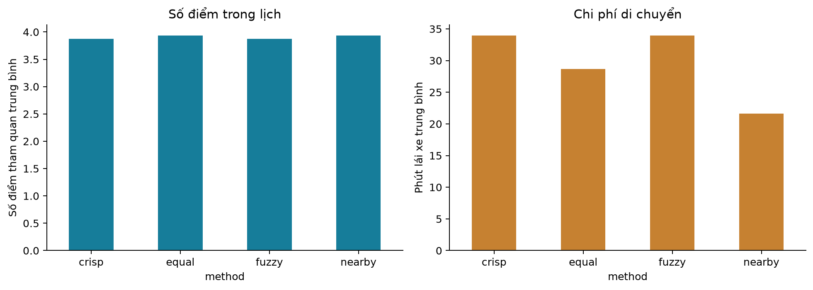

**Diễn giải đúng:** Nearby đi ít hơn theo thiết kế. Crisp/fuzzy có thể đánh đổi di chuyển để ưu tiên tiêu chí khác, nhưng chưa có nhãn độc lập để khẳng định đánh đổi đó đáng giá. Fuzzy và crisp cùng thứ tự ở 16/16 kịch bản do cấu hình mặc định. Tất cả provisional phù hợp với thiếu access/duration/giờ; không được đổi nhãn thành ready để cải thiện tỷ lệ.

Các lượt chạy lại trong đợt biên soạn cũng cho 64/64 provisional. Không dùng thời gian của lượt Nearby đầu tiên làm bằng chứng thuật toán chậm hơn, vì thứ tự chạy cố định, cache OSRM, khởi tạo và pool đều ảnh hưởng. Benchmark latency tốt cần warm-up, đổi thứ tự phương pháp, lặp nhiều lần và công bố p50/p95 cùng phần cứng.

### 9.3. Bảy tình huống planner cũ và mới

[`evaluate_trip_choices.py`](../scripts/evaluate_trip_choices.py) dùng các ca có chủ đích: một điểm thiếu metadata, hai bãi biển, khung giờ ngắn, một đền, nhóm văn hóa, bảo tàng buổi chiều và chỉ ăn uống.

| Chỉ số | Kết quả |
|---|---:|
| Planner nghiên cứu có lịch | 2/7 |
| Luồng mới có ít nhất một phương án | 7/7 |
| Luồng mới có phương án hoặc hành động tiếp theo | 7/7 |
| Giữ đủ bắt buộc trong khung ban đầu | 5/7 |
| Giữ đủ bắt buộc nếu xét cả đổi khung giờ | 7/7 |
| Tổng chặng Route và timeline nhất quán trong evaluator | PASS |

Đây là cải thiện xử lý các ca sử dụng đã chọn. Không phải tỷ lệ thành công 100% trên mọi chuyến đi; hai hệ có hợp đồng khác nhau, planner cũ có thể thêm điểm ngoài lựa chọn và đòi metadata chặt hơn. Không dùng 2/7 → 7/7 để tuyên bố thuật toán xếp hạng chính xác hơn 250%.

### 9.4. Chỉ số chất lượng cần dùng khi có nhãn

Với top-$K$ là $L_u^K$, tập POI liên quan độc lập $G_u$, $rel_u(k)\in\{0,1\}$:

$$
Precision@K=\frac{|L_u^K\cap G_u|}{K},\qquad Recall@K=\frac{|L_u^K\cap G_u|}{|G_u|},
$$

$$
AP@K=\frac{\sum_{k=1}^{K}Precision@k\cdot rel_u(k)}{\min(K,|G_u|)},\quad
MAP@K=\frac1{|U|}\sum_u AP_u@K,
$$

$$
DCG@K=\sum_{k=1}^{K}\frac{2^{g_{u,k}}-1}{\log_2(k+1)},\quad NDCG@K=DCG@K/IDCG@K,
$$

$$
MRR@K=\frac1{|U|}\sum_u\frac1{rank_u^{first}},\qquad
HitRate@K=\frac1{|U|}\sum_u\mathbf1[|L_u^K\cap G_u|>0].
$$

Không có hit thì reciprocal rank bằng 0; tập liên quan rỗng hoặc IDCG bằng 0 phải ghi quy ước (hàm hiện tại trả 0). [`where2go/evaluation.py`](../where2go/evaluation.py) hỗ trợ AP, NDCG, recall, MRR, hit rate với grade 0–3 và không chấp nhận ID gợi ý trùng. Chưa gọi các metric này trên dữ liệu không có nhãn rồi công bố như kết quả thực.

Với lịch trình cần thêm:

$$
Coverage_{selected}=\frac{|S\cap\pi|}{|S|},\quad Coverage_{must}=\frac{|M\cap\pi|}{|M|},\quad
FeasibleRate=\frac{\#\text{lịch qua kiểm tra ràng buộc}}{\#\text{lịch được đánh giá}}.
$$

Khi không có điểm bắt buộc nên báo N/A hoặc quy ước riêng. Tách coverage khung gốc và coverage sau thay đổi. Báo thêm chờ, lái, vi phạm giờ, tỷ lệ cảnh báo, thời gian hoàn thành thao tác, mức hài lòng; nhiều POI hơn không tự động tốt hơn.

### 9.5. Thiết kế đánh giá tiếp theo

1. Đóng băng snapshot, tập ứng viên, cấu hình và phiên bản OSRM; không thay dữ liệu giữa các phương pháp.
2. Chọn người chấm độc lập với người chỉnh trọng số. Thu rubric POI 0–3 trên toàn pool đánh giá và rubric lịch 1–5 riêng; không suy nhãn POI từ tổng điểm lịch.
3. Ẩn tên phương pháp, đổi thứ tự trình bày. Phiếu owner hiện có chỉ là chuẩn bị, chưa thay thế nhóm người dùng độc lập.
4. Ablation: taxonomy-only; text-only; bỏ quality; bỏ confidence; equal/crisp/fuzzy với bất định không đồng nhất có nguồn; đo thêm độ ổn định top-K khi dữ liệu thiếu.
5. Chỉ chỉnh tham số trên development, giữ holdout; nếu xem kết quả holdout để chỉnh nhiều lần thì tạo tập test mới.
6. So sánh theo cặp cùng người/kịch bản; bootstrap theo **người/kịch bản**, không theo từng dòng POI phụ thuộc nhau. Với $\Delta_b$ từ bootstrap, CI 95% là phân vị 2,5% và 97,5%; CI rộng cần tăng mẫu, không chọn số lượt tùy tiện để đạt ý nghĩa.
7. Khi có check-in: chia theo thời gian toàn cục, fit mọi graph/prior/vocabulary từ phần được phép; loại rò rỉ tương lai và giữ tập item khả dụng ở thời điểm dự đoán.

## 10. Bài báo LORE 2014

**Nguồn [P1]:** Jia-Dong Zhang, Chi-Yin Chow, Yanhua Li. *LORE: Exploiting Sequential Influence for Location Recommendations*. ACM SIGSPATIAL 2014, tr. 103–112. DOI: [10.1145/2666310.2666400](https://doi.org/10.1145/2666310.2666400). Đã đọc [PDF trong dự án](../paper/2014-Lore%20exploiting%20sequential%20influence%20for%20location%20recommendations.pdf). Số trang dưới đây là **trang PDF 1–10**, tránh nhầm với số trang kỷ yếu.

### 10.1. Bài toán và ý tưởng

Đầu vào gồm user, POI đã check-in, timestamp, tọa độ và quan hệ xã hội. Đề xuất **POI mới đối với người dùng** dựa trên ảnh hưởng tuần tự, xã hội và địa lý. Luận điểm: địa điểm tiếp theo phụ thuộc không chỉ điểm cuối mà cả các điểm trước, với ảnh hưởng giảm dần. LORE không trực tiếp giải bài toán giờ mở cửa–đường về–thời lượng của Where2Go; chính kết luận bài báo nêu gợi ý chuyến đi là hướng tương lai [P1, tr. PDF 9, §7].

### 10.2. L2TG và Additive Markov Chain

Chuỗi $S_u=\langle(l_1,t_1),\ldots,(l_n,t_n)\rangle$. Chỉ đếm chuyển tiếp liên tiếp nếu $t_{i+1}-t_i\le\Delta T$. Đồ thị L2TG lưu `TCount(i,j)` và `OCount(i)` thay vì chỉ xác suất, để cập nhật khi check-in mới đến [P1, tr. 3–4, Eq. 1–7].

$$
TP(i\to j)=\frac{TCount(i,j)}{OCount(i)}.
$$

Nếu outgoing count bằng 0, bài báo quy ước self-transition bằng 1, chuyển sang điểm khác bằng 0. FMC chỉ dùng $TP(l_n\to j)$. AMC dùng:

$$
W(l_i)=2^{-\alpha(n-i)},\quad
p_{seq}(j\mid S_u)=\frac{\sum_{i=1}^{n}W(l_i)TP(l_i\to j)}{\sum_{i=1}^{n}W(l_i)},\quad\alpha\ge0.
$$

$\alpha=0$ cho trọng số bằng nhau; $\alpha$ lớn ưu tiên điểm gần cuối. Đây là tổng các đóng góp chuyển tiếp, tránh không gian trạng thái tăng theo lũy thừa của Markov bậc cao đầy đủ. Bài báo mô tả cập nhật count O(1)/check-in, tính AMC O(n)/ứng viên; ma trận đếm có thể lưu sparse. Thứ tự crawl/Excel không thể thay chuỗi người dùng.

### 10.3. Ảnh hưởng xã hội, địa lý và hợp nhất

Với $r_{u',j}$ là tần suất check-in:

$$
\hat r^{soc}_{u,j}=\frac{\sum_{u'\ne u}SocSim(u,u')r_{u',j}}{\sum_{u'\ne u}SocSim(u,u')},
$$

$$
SocSim(u,u')=\begin{cases}
1-\frac{distance(u,u')}{\max_{u''\in F(u)}distance(u,u'')},&u'\in F(u),\\
0,&u'\notin F(u).
\end{cases}
$$

Khoảng cách này là giữa nơi cư trú theo mô hình paper. Không có bạn hoặc mẫu số 0 cần quy ước khi tái triển khai, không âm thầm giả dữ liệu xã hội.

KDE hai chiều trên tọa độ $l_i$ của lịch sử:

$$
p_{geo}(j\mid S_u)=\frac1{n\sigma^2}\sum_{i=1}^{n}K\left(\frac{l_j-l_i}{\sigma}\right),\quad
K(x)=\frac1{2\pi}\exp(-\tfrac12x^Tx),
$$

$$
\hat\mu=\frac1n\sum_i l_i,\quad
\hat\sigma=\sqrt{\frac1n\sum_i(l_i-\hat\mu)^2},\quad
\sigma=n^{-1/6}\sqrt{\tfrac12\hat\sigma^T\hat\sigma}.
$$

Phép bình phương/căn trong vector độ lệch chuẩn tính theo thành phần. KDE là mật độ theo tọa độ, không phải thời gian đường bộ hoặc xác suất rời rạc đã chuẩn hóa trên mọi POI. Điểm hợp nhất dùng **tích**, không phải tổng trọng số [P1, tr. 5, Eq. 8–15]:

$$
\hat s_{u,j}=p_{seq}(j\mid S_u)\,\hat r^{soc}_{u,j}\,p_{geo}(j\mid S_u).
$$

Một thành phần 0 có thể triệt tiêu tích; đây là điểm phải xem xét khi dữ liệu rất thưa hoặc cold-start.

### 10.4. Thực nghiệm và bài học

| Dataset theo P1, bảng 1 | Users | POI | Check-in | Social links |
|---|---:|---:|---:|---:|
| Foursquare | 11.326 | 182.968 | 1.385.223 | 47.164 |
| Gowalla | 196.591 | 1.280.969 | 6.442.890 | 950.327 |

[P1, tr. 6–7, §5] chia nửa dữ liệu theo timestamp trước/sau thành train/test, không chia ngẫu nhiên. Mặc định $\Delta T=1$ ngày, $\alpha=0,05$; khảo sát K và độ dài lịch sử 2–50. So sánh FMC, AMC, iGSLR, GS2D, FMC+GS2D và LORE bằng Precision/Recall. Tác giả ghi nhận LORE nhìn chung tốt nhất trong thiết lập đó; không chép giá trị từ đường biểu đồ như số đo chính xác của nhóm.

Bài học áp dụng: coi chuyển tiếp hành vi khác với đường di chuyển vật lý; dùng baseline có ablation từng nguồn ảnh hưởng; chia thời gian để tránh tương lai. Hạn chế khi chuyển sang dự án: chưa có check-in, social graph, nơi cư trú; khoảng cách KDE không xác nhận đường ô tô; mô hình khó phục vụ khách mới nếu không có fallback.

## 11. Bài báo Contextualized Point-of-Interest Recommendation 2020

**Nguồn [P2]:** Peng Han, Zhongxiao Li, Yong Liu, Peilin Zhao, Jing Li, Hao Wang, Shuo Shang. *Contextualized Point-of-Interest Recommendation*, bản PDF năm 2020 trong thư mục paper, tên file gắn IJCAI. [PDF nguồn](../paper/2020-Contextualized%20Point-of-Interest%20Recommendation-IJCAI.pdf). Bản PDF được cung cấp không hiện đầy đủ DOI/trang kỷ yếu ở trang đầu; không tự điền metadata xuất bản chưa xác minh. Dẫn số trang PDF 1–7 và số phương trình của chính bản này.

### 11.1. Bài toán và hai cấp ngữ cảnh

$Y\in\{0,1\}^{m\times n}$ là ma trận check-in: người dùng đã ghé POI thì 1, chưa quan sát thì 0. Mô hình dự đoán ma trận $R$, loại POI đã ghé khi đề xuất top-K. “Rating” trong bài này chủ yếu là tín hiệu check-in nhị phân, **không phải sao Google 1–5**.

Ngữ cảnh global: đồ thị tương đồng user và POI; ngữ cảnh local: cụm người dùng bằng spectral clustering. “Local” ở đây là nhóm tương đồng, không phải đơn thuần một địa phương hành chính [P2, tr. 2–3, §3–4].

### 11.2. Xây dựng graph

Vector user có $24n$ chiều, ghi check-in tại mỗi POI trong từng giờ. Cosine tạo $S^{ST}$. $S^{SR}$ là quan hệ xã hội nhị phân; hệ số làm trơn $\alpha_u$:

$$
S^{user}=\frac{(\alpha_u+S^{SR})\odot S^{ST}}{1+\alpha_u}.
$$

POI có vector 24 giờ, cosine tạo $S^{TE}$. Địa lý dùng Gaussian:

$$
S^{GE}_{ij}=\exp\left(-\frac{\|x_i-x_j\|_2^2}{2\sigma^2}\right),\qquad
S^{poi}=\frac{(\alpha_p+S^{TE})\odot S^{GE}}{1+\alpha_p}.
$$

$\odot$ là tích từng phần tử. Đây là công thức cụ thể Eq. 8 và 10; không mô tả triển khai này đơn giản là cộng mọi loại similarity. Từ similarity dựng k-NN graph. Khi tái hiện cần công bố cách đối xứng hóa k-NN và xử lý đỉnh bậc 0 để giữ giả thiết graph vô hướng [P2, tr. 4, §4.3].

### 11.3. Laplacian và hàm mục tiêu

Với trọng số cạnh $W$, $D_{ii}=\sum_jW_{ij}$, normalized Laplacian:

$$
L=I-D^{-1/2}WD^{-1/2}.
$$

Các phần global:

$$
\mathcal L_{user}(R)=\operatorname{tr}(R^TL_{user}R),\qquad
\mathcal L_{poi}(R)=\operatorname{tr}(RL_{poi}R^T).
$$

Phạt này khuyến khích các đối tượng tương đồng có dự đoán tương đồng. Spectral clustering chia user thành G cụm; regularizer local:

$$
J(R)=\sum_{g=1}^{G}\sum_{j=1}^{n}\omega_g\|R_{(g),j}\|_2,\qquad\omega_g=\sqrt{n_g}.
$$

Đây là group lasso, không phải bình phương L2 từng phần tử: khuyến khích mẫu thưa theo nhóm. Mục tiêu Eq. 6:

$$
\min_R\frac12\left[\lambda_1\mathcal L_{user}(R)+\lambda_2\mathcal L_{poi}(R)
+\lambda_3\|R-Y\|_F^2+\lambda_4J(R)\right].
$$

Cần nhấn mạnh chưa quan sát $Y_{ij}=0$ không chắc người dùng không thích; phép khớp Frobenius trên ma trận nhị phân đặt ra vấn đề implicit feedback khi diễn giải. Regularization tận dụng cấu trúc ngữ cảnh, không tạo ra lịch khả thi.

### 11.4. Tối ưu được trình bày trong paper

Algorithm 1 luân phiên user step và POI step với biến trung gian $T$. User step dùng Accelerated Proximal Gradient (APG), phần trơn có gradient:

$$
\nabla_R\mathcal L_{1,sm}=\lambda_1L_{user}R+\lambda_3(R-T).
$$

Phần group lasso được xử lý bằng co mềm theo nhóm: nhóm có norm thấp hơn ngưỡng bị đưa về 0; nhóm còn lại giảm norm. POI step giải hệ tuyến tính [P2, tr. 5, Eq. 18–19]:

$$
R(\lambda_2L_{poi}+\lambda_3I)=\lambda_3T.
$$

Không nên gọi đây là matrix factorization hay GNN: bài báo trực tiếp tối ưu ma trận dự đoán bằng graph regularization. Bài báo cũng nói hai biến trung gian khi ổn định có thể khác nhau và chọn đầu ra user step; khi tái hiện cần bám Algorithm 1, không tự khẳng định một vòng truyền graph là nghiệm tối ưu duy nhất của Eq. 6.

### 11.5. Thực nghiệm và kết quả có thể dẫn

| Dataset theo P2, §5.1 | Users | POI | Check-in |
|---|---:|---:|---:|
| Gowalla | 18.737 | 32.510 | 1.278.274 |
| Yelp | 30.887 | 18.995 | 860.888 |

Chia check-in mỗi user 70% train, 20% tuning, 10% test. Đo P@K, R@K với K = 5, 10, 20, 50. Đoạn mô tả này **không khẳng định rõ chia theo thời gian**, nên không trình bày là cùng protocol LORE. Hai paper cùng dùng tên Gowalla nhưng có quy mô và tiền xử lý khác; không so trực tiếp số tuyệt đối qua hai bài.

| Dataset | P@10 của mô hình P2 | R@10 của mô hình P2 | LORE trong thí nghiệm P2: P@10 / R@10 |
|---|---:|---:|---:|
| Gowalla | 0,0586 | 0,0789 | 0,0323 / 0,0397 |
| Yelp | 0,0271 | 0,0542 | 0,0198 / 0,0306 |

Nguồn: P2, bảng 1–2, trang PDF 5–6. Đây là số do **tác giả P2 công bố**, nhóm chưa tái chạy; không phải kết quả Where2Go. Các baseline còn gồm USG, iGSLR, LFBCA, IRenMF, GeoMF, MGMPFM, GeoPFM và Caser. Phân tích tham số cho thấy regularization quá mạnh cũng giảm kết quả; local term có lợi ích nhỏ hơn global terms trong thiết lập bài báo.

Bài học áp dụng: ngữ cảnh nên biểu diễn rõ và kiểm tra từng thành phần; thuật toán phức tạp cần dữ liệu tương ứng. Khó khăn: ma trận user–POI lớn, xây graph và clustering tốn tài nguyên; cold-start, sparsity và implicit zeros vẫn cần xử lý; thuật toán này chưa kiểm tra thời gian đi, mở cửa hoặc quay về.

## 12. Đối chiếu và kế hoạch kế thừa

### 12.1. Ma trận so sánh

| Khía cạnh | LORE 2014 | Contextualized POI 2020 | Where2Go hiện hành |
|---|---|---|---|
| Đầu ra | Top-K POI mới theo lịch sử | Top-K POI mới từ ma trận dự đoán | POI bổ sung và lịch cho tập người dùng chọn |
| Dữ liệu chính | Chuỗi check-in, xã hội, địa lý | Check-in, giờ, xã hội, địa lý | Metadata POI, sở thích khai báo, giờ, đường, duration |
| Cá nhân hóa | Theo chuỗi và bạn bè | Theo user trong graph/cụm | Hồ sơ sở thích khai báo, TF-IDF/taxonomy; chưa học hành vi |
| Tuần tự | AMC trên L2TG | Không dùng AMC; vector check-in theo giờ | Tìm thứ tự đường đi, không học chuyển tiếp hành vi |
| Địa lý | KDE tọa độ hai chiều | Gaussian similarity giữa POI | Haversine lọc và fallback; OSRM khi đủ đường; mode có nhãn |
| Kết hợp | Tích sequential × social × geographic | Laplacian + group lasso + reconstruction | AHP–TOPSIS với bốn mẫu ưu tiên; fuzzy là đối chiếu; planner riêng |
| Dữ liệu thiếu | Phụ thuộc history/social; cần fallback | Regularization hỗ trợ sparsity, vẫn cần graph | Gate, neutral mặc định, unknown và cảnh báo |
| Ràng buộc chuyến | Không trực tiếp giải | Không trực tiếp giải | Ngày/giờ, duration, bắt buộc, thứ tự, quay về |
| Đánh giá | Precision/Recall, chia thời gian 50/50 | P@K/R@K, 70/20/10 mỗi user | 16 bối cảnh × 6 phương pháp; sensitivity; pooled grading chưa có nhãn |
| Đã triển khai trong repo | Chưa | Chưa | Có |

Điểm giống nhau là coi địa lý và ngữ cảnh quan trọng, kết hợp nhiều tín hiệu để chọn POI, đối diện dữ liệu thưa. Điểm khác là dữ liệu đầu vào, ý nghĩa “context”, mục tiêu và cách đánh giá. Không dùng phép nhân LORE để mô tả TOPSIS; không gọi beam search là Markov; không coi rating Google là ma trận check-in của P2.

### 12.2. Vì sao lựa chọn hiện tại hợp lý với dữ liệu

Metadata tồn tại nhưng lịch sử tương tác không tồn tại. Content-based và MCDM chạy được khi chưa có user history, giải thích được từng tiêu chí và phù hợp bài toán DSS. OSRM và mô phỏng giải quyết khả năng thực hiện chuyến đi mà hai paper không trực tiếp xử lý. Đổi lại, mô hình phụ thuộc sở thích tự khai báo và chính sách trọng số; chưa có bằng chứng chất lượng cá nhân hóa tốt hơn các mô hình học từ hành vi.

### 12.3. Hướng kế thừa có điều kiện

| Hướng | Dữ liệu cần bổ sung | Cách tích hợp dự kiến | Đánh giá phải làm |
|---|---|---|---|
| AMC theo LORE | Chuỗi `(user/session_id, poi_id, timestamp)` đáng tin | Thêm tín hiệu sequential vào bộ tạo/xếp hạng ứng viên; planner vẫn kiểm tra ràng buộc | FMC vs AMC, temporal split, cold-start và coverage |
| POI graph theo P2 | Metadata chuẩn hơn, tương tác/giờ nếu theo đúng paper | Thử similarity POI sparse; khi có user mới dựng user graph và local groups | Bỏ từng graph/local term, tuning riêng, tài nguyên |
| Học trọng số | Phán đoán cặp hoặc lựa chọn thực của người dùng | So trọng số thiết kế với trọng số có nguồn, vẫn giải thích được | Holdout chưa dùng để chỉnh, confidence interval |
| Kết hợp đường vòng | Ma trận/route của tập đang chọn | Xếp hạng bổ sung theo mức tăng chi phí toàn tuyến | Chất lượng, feasibility, latency so với thời gian từ xuất phát |

Log click/thêm điểm/chọn lịch chỉ là **implicit preference**, không tự đổi thành check-in đã đến nơi. Dùng loại sự kiện rõ ràng, cho phép người dùng đồng ý chia sẻ, và công bố proxy label khi nghiên cứu. Không tạo user giả hoặc chuỗi giả rồi coi đó là bằng chứng tái hiện paper.

Để so định lượng công bằng với paper: hoặc tái hiện các mô hình trên một benchmark chung có license phù hợp và cùng split/pool/metric; hoặc thu tương tác của dự án rồi đánh giá mọi baseline trong cùng protocol. Điểm P@10 trên Gowalla không thể đặt cạnh tỷ lệ 7/7 có lịch ở Việt Nam để suy ra phương pháp nào tốt hơn.

## 13. Điểm mạnh, hạn chế và hướng phát triển

### 13.1. Điểm mạnh có thể chứng minh

- Pipeline có provenance, checksum, staging/audit và canonical ID; giữ nguồn mâu thuẫn để đối chiếu.
- Tách khám phá, chọn thủ công và đề xuất tự động, nên không phải loại toàn bộ POI thiếu rating khỏi trải nghiệm.
- Tiêu chí có công thức và giải thích; chi phí xe lấy từ đường bộ; thứ tự ghé kiểm tra mở cửa và đường về.
- Luồng nhiều phương án cho người dùng kiểm soát; đề xuất đổi giờ/bớt điểm được nêu rõ, có chỉnh tay và nháp.
- Có notebook thực thi được, biểu đồ/bảng xuất và kiểm thử thuật toán, API, trình duyệt.

### 13.2. Hạn chế và tác động

| Hạn chế | Tác động | Cách giảm thiểu |
|---|---|---|
| Rating chỉ phủ 0,54% | Chất lượng POI khó phân biệt rộng; thiếu dữ liệu ảnh hưởng thứ hạng | Ablation missingness, bổ sung mẫu trọng tâm |
| Giờ/access/duration chưa xác minh đủ | Lịch provisional có thể khác thực tế | Xác minh từng POI ưu tiên, kiểm tra tại ngày đi |
| TF-IDF dựa mô tả thưa | Sở thích ngoài taxonomy khó khớp | Curation nội dung, thử mô hình ngữ nghĩa sau khi có nhãn |
| Trọng số thiết kế, fuzzy mặc định trùng crisp | Chưa chứng minh giá trị gia tăng của fuzzy | Thu phán đoán và độ bất định riêng; giữ crisp baseline |
| Shortlist và beam giới hạn | Có thể bỏ lỡ phương án tốt; không chứng minh vô nghiệm | Đo sensitivity beam/pool, exact solver cho bài nhỏ làm tham chiếu |
| OSRM không có traffic live | Giờ đi/về chỉ là ước lượng theo hồ sơ mạng đường | Công bố giới hạn, đo sai số thực tế, thêm buffer có cơ sở |
| Mẫu đánh giá nhỏ/có chủ đích | Không suy rộng satisfaction/accuracy | Người chấm độc lập, protocol và khoảng tin cậy |
| Dữ liệu Google nội bộ | Không mặc nhiên phát hành public dataset | Tách export công khai được phép và nguồn restricted |
| Nhiều đường code v1/v2 | Dễ trình bày nhầm công thức/hợp đồng | Tài liệu chỉ rõ endpoint; chỉ gỡ khi đã bỏ phụ thuộc và baseline |

### 13.3. Lộ trình theo giá trị

**Trước buổi bảo vệ:** đóng băng snapshot, kiểm tra demo, đọc các hình và mẫu số; chuẩn bị hai ca đủ/thiếu giờ; chấm đồng thuận trong nhóm một mẫu nhỏ và báo đúng là pilot nếu thực sự thực hiện. Không cần thêm mô hình phức tạp để tăng số thuật ngữ.

**Ưu tiên tiếp theo:** kiểm duyệt tập 140 POI, đặc biệt giờ/ngày lễ và cổng xe; thu thời lượng thực hoặc nguồn đủ tin cậy; lấy mẫu đối chiếu entity matching. Báo precision của ghép tự động trên mẫu được kiểm duyệt, cùng khoảng tin cậy và phân tầng tên phổ biến/khu lớn/khác địa phương.

**Sau khi có nhãn:** benchmark ranking độc lập, ablation và sensitivity; đánh giá usability; cải thiện cách xử lý missing quality và đường vòng. Thu sự kiện tương tác có phân loại, sau đó mới thử AMC/graph và công bố tác động thực.

**Dài hạn:** nhiều phương tiện/nhiều ngày, time-dependent routing, cá nhân hóa học từ hành vi và dữ liệu đầy đủ hơn. Mỗi hướng cần đầu vào, chi phí và metric riêng; không ghi là tính năng đã hoàn thành.

## 14. Cấu trúc báo cáo và bằng chứng

### 14.1. Cách chuyển tài liệu thành báo cáo chính thức

1. **Mở đầu:** động cơ, ví dụ chuyến đi, mục tiêu và câu hỏi nghiên cứu.
2. **Cơ sở và liên quan:** POI recommendation, content-based, MCDM, LORE, graph context; xác định khoảng cách dữ liệu/bài toán.
3. **Dữ liệu:** nguồn, schema, crawler, ghép thực thể, provenance, notebook và thiên lệch.
4. **Phương pháp:** bốn tiêu chí, AHP/fuzzy, TOPSIS, tách ranking/planning, ràng buộc và tìm kiếm.
5. **Hệ thống:** kiến trúc, API, trải nghiệm, cách vận hành và tái lập.
6. **Thực nghiệm:** protocol, baseline, kết quả có thật, ablation dự kiến và giới hạn suy luận.
7. **Kết luận:** đóng góp tích hợp, hạn chế dữ liệu/đánh giá và lộ trình có điều kiện.

### 14.2. Bản đồ bằng chứng

| Khẳng định | Nguồn kiểm tra |
|---|---|
| 16.018 POI, phân bố/độ phủ | `data/reports/v2/dataset/summary.json`, CSV và `data/reports/analysis/` |
| Mã crawler và ghép nguồn | `where2go/v2/google_collector.py`, `scripts/collect_enrichment_v2.py`, `scripts/review_enrichment_v2.py`, `scripts/merge_sources_v2.py` |
| Công thức đang chạy | `where2go/v2/recommendations.py`, `ranking.py`, `where2go/ranking.py`, `quality.py` |
| Thực nghiệm gợi ý hiện tại | `scripts/evaluate_recommendations.py`, `data/reports/recommendations/`, notebook phần 11–13 |
| Lịch mới và giới hạn | `where2go/v2/trips.py`, `trip_models.py` |
| Baseline nghiên cứu | `where2go/v2/planner.py`, `scripts/evaluate_v2.py` |
| Bảng evaluator | `data/reports/v2/evaluation.json`, `trip_choices_evaluation.json`; lượt kiểm chứng lại trong `artifacts/report-validation/` |
| Cấu trúc dữ liệu hợp lệ | `data/reports/v2/dataset/audit.json`; audit mới trong `artifacts/report-validation/audit.json` |
| Biểu đồ và tính toán | `notebooks/phan_tich_du_lieu_poi.ipynb`, `docs/assets/poi/` |
| Phương pháp/số liệu P1 | PDF LORE: §3–4, Eq. 1–15; bảng 1; §5.4, §6–7 |
| Phương pháp/số liệu P2 | PDF Contextualized: §3–4, Eq. 3–10, 15, 19; §5, bảng 1–2 |

Tài liệu này không thay thế bài báo gốc. Các công thức mục 7–8 mô tả mã dự án; mục 10–11 mô tả nghiên cứu tham khảo; mục 9.5 và 12.3 là đề xuất chưa triển khai. Khi làm slide, ghi nguồn dưới hình và nhãn “kết quả nhóm”, “số liệu paper” hoặc “hướng phát triển” để hội đồng dễ đối chiếu.
